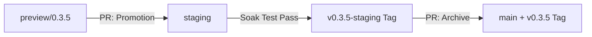

# SafeZone Deployment & GitOps Workflow (v2)

This document standardizes the operational logic of the `SafeZone-Deploy` (Configuration) repository. We follow a **GitOps** model, where the Git repository's state serves as the source of truth for the cluster's desired state.

## 1. Core Philosophy

To achieve production-grade delivery stability within an **MVA (Minimum Viable Architecture)** framework, we combine two paradigms:

*   **Declarative Steady State (ArgoCD)**: Responsible for continuous synchronization of YAML from Git to the cluster and monitoring for resource drift.
*   **Phase-Based Imperative Orchestration (GitHub Actions)**: Responsible for executing stateful tasks such as data seeding, health probing, and environment lifecycle management.
*   **Pragmatic Rollback**: During the rapid iteration of 0.x versions, we avoid over-engineering automated rollback scripts. Instead, we utilize **Git Tagging** to establish environment "Rollback Baselines."

---

## 2. Branch Promotion Model

We have eliminated redundant `dev` branches in favor of a model where each branch corresponds to a **lifecycle stage**:

| Branch Name | Lifecycle Stage | Tagging Strategy | ArgoCD Sync |
| :--- | :--- | :--- | :--- |
| **`preview/<version>`** | **Development & Validation** | **No Tags** (Destroyed with PR) | Auto-updates `safezone-preview` |
| **`staging`** | **Soak Testing & Demo** | **`v0.x.y-staging`** (Baseline) | Auto-syncs `safezone` (Staging) |
| **`main`** | **Version Archive (Golden)** | **`v0.x.y`** (Official Release) | Manual Archive (Env-Agnostic) |

### Why No Tags for Preview?
The `preview/` branch is **transient**. Its lifecycle is bound to a Pull Request. Creating tags for draft work would clutter the Git history with "garbage." The Preview environment is destroyed immediately upon branch merge or closure.

---

## 3. Standard Operating Procedures (SOP)

### Scenario A: Feature Development & Preview Validation
1.  **Branching**: Create `preview/<version>` (e.g., `preview/0.4.0`) from `staging`.
2.  **Configuration**: Modify Helm charts or update image tags.
3.  **Validation**: GitHub Actions automatically triggers a sync to the `safezone-preview` namespace for E2E verification.

### Scenario B: Promotion to Staging
1.  **Promotion PR**: Open a PR from `preview/<version>` to `staging`.
2.  **Environment Adaptation**: Adjust configurations for Staging (e.g., switching from ad-hoc mock servers to platform-grade services).
3.  **Promotion Decision**: Merging the PR serves as the official record of the decision and triggers the Staging orchestration pipeline.

### Scenario C: Baseline Checkpoint & Archiving
1.  **Soak Testing**: Run the release in Staging for 3-5 days to monitor for stability issues.
2.  **Tagging (Checkpoint)**: Once passed, manually tag the `staging` branch as `v0.x.y-staging`.
    *   *Value*: If a subsequent release breaks Staging, ArgoCD's `targetRevision` can be instantly pointed back to this tag for recovery.
3.  **Archiving**: Merge `staging` into `main` and apply the final official version tag `v0.x.y`.

---

## 4. GitHub Actions Orchestrator (Phase-based)

Our `init-deploy.yml` pipeline is divided into distinct phases to ensure ordered deployment.

### Phase 0: Pre-validation
*   Executes `helm template` rendering to prevent broken YAML from reaching the cluster, allowing for early failure detection.

### Phases 1-5: Imperative Orchestration
1.  **Infra Readiness**: Actively probes for PostgreSQL and Kafka connectivity (e.g., `kubectl exec ... ping`).
2.  **Data Seeding**: Triggers the `safezone-seed` Job and waits for completion.
3.  **App Sync**: Verifies that the API health check endpoints return 200 OK.

### Phase 6: Environment Maintenance (Staging Only)
*   **Scheduler Integration**: Enables the `safezone-scheduler` (CronJob) to generate daily simulation data, maintaining environment authenticity for showcases.

---

## 5. Architectural Decision Records (ADR)

### Why eliminate the `dev` branch?
In an MVA project, a `dev` branch adds merging overhead without providing integration value. v2 focuses on **"Promotion via PR"**, ensuring every environment transition has a clear audit trail.

### Why allow feature branches directly into Staging?
Staging is an **active integration environment**. For infrastructure-level adjustments (e.g., NetworkPolicy tuning), allowing direct work on Staging prevents unnecessary "Preview-to-Staging" hop delays.

### Why manual Tag Rollback?
During the high-churn 0.x phase, automated rollback scripts often break due to frequent schema changes. Using **Staging Tags** as baselines is the most cost-effective and reliable compromise—it acknowledges risk and leverages Git native mechanisms to solve it.
