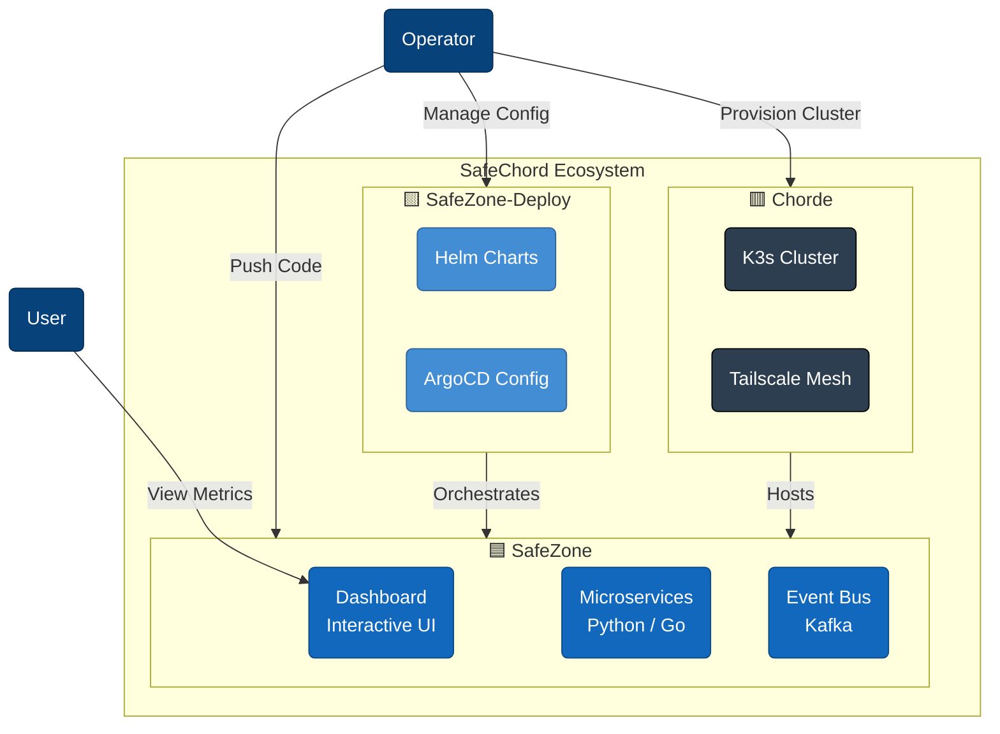

# 🎼 SafeChord Ecosystem

> **From event triggering and asynchronous processing to persistent storage and interactive visualization.**
>
> SafeChord is a production-grade "Cloud-Native Laboratory" designed to demonstrate end-to-end dataflow pipelines and modern SRE practices. Our goal is to prove that high availability and observability can be achieved through disciplined architectural design, even under tight resource constraints.

---

## 🏛️ System Context

SafeChord adheres to strict **Separation of Concerns (SoC)**, decoupling the ecosystem into three primary dimensions: Application, Delivery, and Platform.

---

## 🏗️ Architectural Tiers

| Tier | Positioning | Core Responsibility | Navigation |
| :--- | :--- | :--- | :--- |
| 🟦 **SafeZone** | **Application** | Business logic implementation, including simulators, ingestion gateways, and data workers. | [**App Map**](safechord.safezone.md) |
| 🟨 **SafeZone-Deploy** | **Delivery** | Packaging and lifecycle management. Governs Helm charts and GitOps promotion workflows. | [**Delivery Map**](safechord.safezone.deployment.md) |
| 🟥 **Chorde** | **Platform** | Infrastructure and networking. Manages the hybrid K3han cluster and Tailscale overlay mesh. | [**Platform Map**](safechord.chorde.md) |

---

## 🛠️ Technology Stack

| Domain | Core Technologies | Purpose |
| :--- | :--- | :--- |
| **Languages** | **Python (FastAPI)** | Business logic, Aggregation APIs, Simulators, Dash UI. |
| | **Golang** | High-throughput data workers, Franz-Go consumer. |
| **Data** | **Kafka** | Asynchronous event bus for system decoupling. |
| | **PostgreSQL** | Relational storage for pandemic facts. |
| | **Redis** | Caching and distributed state control. |
| **Platform** | **K3s** | Lightweight Kubernetes distribution for hybrid environments. |
| | **Tailscale** | Peer-to-peer SDN for multi-cloud node connectivity. |
| | **Cloudflare** | DNS management, Tunnels, and Zero Trust access control. |
| **Operations** | **ArgoCD** | Declarative GitOps for continuous delivery. |
| | **KEDA** | Event-driven autoscaling based on Kafka consumer lag. |

---

## 🎯 Design Philosophy

### 1. MVA (Minimum Viable Architecture)
In resource-constrained environments, we prioritize "Necessary Complexity" over "Over-Engineering." Every resource is precisely allocated to segments that deliver the highest architectural value.

### 2. Environment Evolution
The system is designed for environment-agnostic adaptability:
*   **🟢 Local**: Rapid iteration via Docker Compose.
*   **🟡 Preview**: Automated smoke testing within temporary K3s namespaces.
*   **🔴 Platform**: Live operation on the hybrid K3han cluster (Staging).

### 3. KDD (Knowledge-Driven Development)
We practice **"Documentation as Codebase."** All architectural decisions and workflows are recorded in this knowledge base, serving as the Single Source of Truth (SSOT) that drives AI and human collaboration.

---

## 🛣️ Strategic Evolution (Merged Roadmap)

> **"Reliability is not an accident; it is a feature. Optimization is not a guess; it is a measurement."**

SafeChord evolves through disciplined phases, moving from a stable foundation to measurable performance.

| Phase | Theme | Objective |
| :--- | :--- | :--- |
| **v0.3.x** | **Stabilization** | ✅ **Completed**. Unified microservice scaffolds and backfilled unit tests. |
| **v0.3.5** | **Modernization** | **Current**. Migrating to English-first documentation and React SPA frontend. |
| **v0.4.x** | **Stress Testing & Reliability** | Integrating load testing tools and defining Service Level Objectives (SLOs) to establish architectural baselines. |
| **v0.5.x** | **Scaling** | Surgically optimizing throughput bottlenecks based on collected metrics. |

*For granular task tracking, active sprints, and real-time status, please refer to our [**GitHub Issues Board**](https://github.com/SafeChord/SafeZone/issues).*

---

## 🚀 Getting Started

If this is your first time here, we recommend the following reading path:
1.  **System Overview** (This document)
2.  [**Environment Evolution**](safechord.environment.md)
3.  [**Knowledge Tree (Safechord Wiki Navigation)**](safechord.knowledgetree.md)
