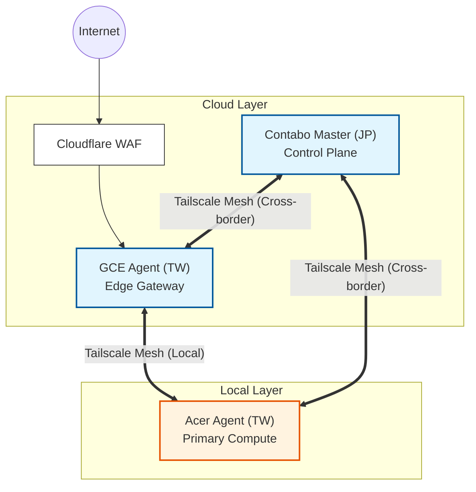

# K3han Cluster Topology (Strategy)

> **Strategic Goal**: Construct a production-grade hybrid cloud spanning Japan and Taiwan with a total budget under **NT$800/month**, optimizing for high-availability management and high-IOPS data persistence.

---

## 1. Physical Topology: Hub & Spoke

K3han utilizes a **Hub & Spoke** architecture distributed across three zones, interconnected via **Tailscale VPN Overlay** to bypass NAT and cross-border firewall restrictions.

### 📊 Node Specifications & Cost Strategy

> 💡 **Infrastructure Snapshot**: The following table aggregates the physical node configurations (as of v0.3.0). While GitOps manages the state, this table provides immediate context on the hardware capabilities.

| Node Name | Role | Hardware (CPU / RAM) | Location | Est. Cost | Status |
| :--- | :--- | :--- | :--- | :--- | :--- |
| **`ct-serv-jp`** | **Control Center** | 6 vCPU / 12GB RAM (Contabo VPS) | 🇯🇵 Japan | ~ NT$350/mo | ✅ Active |
| **`gce-agent-tw`** | **Ingress Gateway** | 2 vCPU / 1GB RAM (GCE e2-micro) | 🇹🇼 Taiwan | ~ NT$450/mo | ✅ Active |
| **`acer-agent`** | **Primary Worker** | i5-8500 / 16GB RAM (N4660G) | 🇹🇼 Home Lab | $0 (Sunk Cost) | ✅ Active |
| **`laptop-agent`** | **Spot Worker** | i7-4720HQ / 16GB RAM (MSI) | 🇹🇼 Home Lab | $0 (Sunk Cost) | ⚠️ Standby |
| **`desktop-agent`** | **Burst Worker** | i5-13600K / 28GB RAM (Custom) | 🇹🇼 Home Lab | $0 (Sunk Cost) | ⚠️ Standby |

### Topology Visualization

---

## 2. Network Latency Constraints

Geographic dispersion makes **Latency** the primary design constraint for all scheduling and data-flow decisions.

### Design Constraints (Red Walls)
*   **Cross-border latency must remain below 100ms** to support async DB replication.
*   **User-facing traffic path must stay within a single geographic region** (TW→TW) to minimize jitter.
*   **Local-node communication must be sub-millisecond** for DB Replica and Cache reads.

### Reference Measurements (Snapshot, verified via Tailscale Ping)

> These are point-in-time observations that validated the above constraints. Current values may drift; verify via `Chorde/scripts/test/` if needed.

| Source | Target | Measured Latency | Constraint Validated |
| :--- | :--- | :--- | :--- |
| **GCE (Ingress)** | **Acer (Worker)** | **~6ms** | Same-region forwarding ✅ |
| **Contabo (Master)** | **Acer (Worker)** | **~80ms** | Cross-border < 100ms ✅ |
| **Local Nodes** | **Local Nodes** | **< 1ms** | Sub-ms local access ✅ |

### Architectural Decisions Derived from Constraints
*   **Mandatory Read/Write Splitting**: Cross-border latency prohibits synchronous DB replication. On-prem applications **MUST** query local Read Replicas; writes to the JP Primary are asynchronous only.
*   **Edge Ingress Policy**: All public traffic routes through the Taiwan GCE node to leverage Google’s backbone, keeping user-facing hops within TW.

---

## 3. MVA Design Philosophy

1.  **Budget Precision**: Prioritize costs on Contabo (JP) for its superior RAM/CPU ratio while using GCE (TW) exclusively for low-latency network peering.
2.  **Heterogeneity Management**: Acknowledges that the home lab node (`acer-agent`) may go offline. Therefore, critical Control Plane services are pinned to cloud nodes, while the "Compute-Heavy Tier" remains local.
3.  **Recursive GitOps**: All cluster components are orchestrated via `gitops/k3han/root.yaml`, enabling a full "one-click" platform cold start.

---

## 4. References
*   **Networking Spec**: [Ingress & Perimeter Policy](safechord.chorde.k3han.ingress.md)
*   **Orchestration Spec**: [K3han Scheduling Strategy](safechord.chorde.k3han.scheduling.md)
*   **Source Code**: `Chorde/cluster/k3han/` (Ansible Playbooks)
