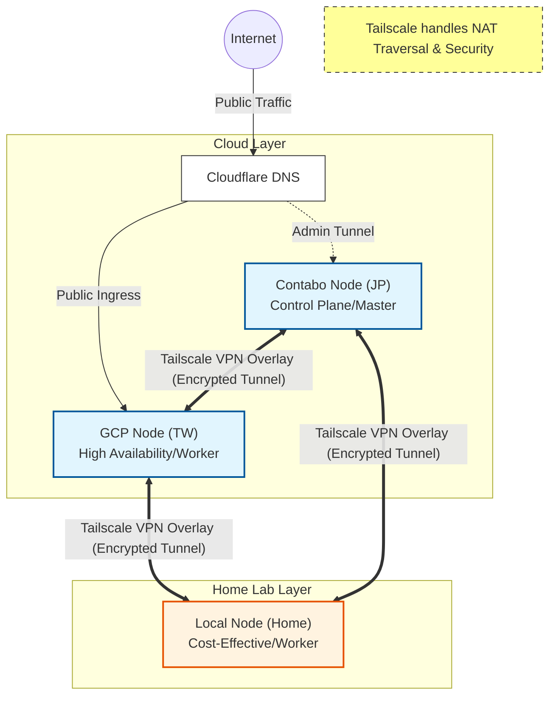

# K3han Cluster (Blueprint)

> **Blueprint (藍圖型)**：定義 SafeChord 生產環境叢集的物理與邏輯基礎設施。
> *重點：混合雲拓撲、延遲管理、成本效益。*

## 1. 職責與定位 (Responsibility)
**K3han** 是 SafeChord 的核心運行載體，一個基於 **K3s** 建構的 **混合雲 (Hybrid Cloud)** 叢集。本藍圖定義了節點的角色分配與網絡互連規範。

*   **Cost Efficiency (MVA)**: 採用 "Scatter-Gather" 策略，整合低成本 VPS (Contabo) 與 GCP 入口資源。**總體營運成本控制在約 NT$800/月 以內**，達成高性能與低負擔的平衡。
*   **Network Overlay**: 透過 **Tailscale** 建立跨國、跨網段的統一內網 (Mesh Network)，屏蔽底層網路差異。
*   **Split Architecture**: 將 "Control Plane" (高穩定) 與 "Data Plane" (高效能) 物理分離。
*   **Provisioning Strategy**: 目前採用 **Manual Provisioning (手動建置)**，輔以 Ansible Inventory 作為靜態資產紀錄。

## 2. 物理拓撲 (Physical Topology)
本叢集採用 **"Hub & Spoke"** 物理架構，節點分散於三個地理區域。

### 節點規格表 (Node Specification)
| Node Name | Role | Hardware / Spec | Location | Cost Strategy | Status |
| :--- | :--- | :--- | :--- | :--- | :--- |
| **`ct-serv-jp`** | **Control Plane** | 6 vCPU / 12GB RAM (Contabo Cloud VPS 20 NVMe) | 🇯🇵 Japan | ~ NT$350/mo | ✅ Active |
| **`gce-agent-tw`** | **Ingress Gateway** | 2 vCPU / 1GB RAM (GCE e2-micro, asia-east1) | 🇹🇼 Taiwan | ~ NT$450/mo | ✅ Active |
| **`acer-agent`** | **Worker (Primary)** | i5-8500 / 16GB RAM (Acer VERITON N4660G) | 🇹🇼 Taiwan | Sunk Cost | ✅ Active |
| **`laptop-agent`** | **Worker (Spot)** | i7-4720HQ / 16GB RAM (MSI GE70 2PL) | 🇹🇼 Taiwan | Sunk Cost | ⚠️ Standby |
| **`desktop-agent`** | **Worker (Spot)** | i5-13600K / 28GB RAM (Custom Build + WSL) | 🇹🇼 Taiwan | Sunk Cost | ⚠️ Standby |

> **Note**: `acer-agent` 承擔主要業務負載 (Apps, DB)，利用本地硬體的 IOPS 優勢。

### 拓撲可視化 (Topology Visualization)

## 3. 網絡架構 (Network Architecture)
由於節點分散，**網路延遲 (Latency)** 是 K8s 調度決策的核心約束。

### 延遲矩陣 (Latency Matrix)
基於 `tailscale ping` 實測數據：

| Source | Target | Avg Latency | Impact Analysis |
| :--- | :--- | :--- | :--- |
| **GCE (Ingress)** | **Acer (Worker)** | **~6ms** | ✅ **Excellent**. 適合 Public Request 轉發 (User -> Ingress -> App)。 |
| **GCE (Ingress)** | **Contabo (Master)** | ~48ms | ⚠️ Acceptable. 僅影響 API Server 通訊，不影響用戶流量。 |
| **Contabo (Master)** | **Acer (Worker)** | **~80ms** | ❌ **High**. **禁止** 跨節點同步資料傳輸 (如 DB Replication)。 |
| **Local Nodes** | **Local Nodes** | < 1ms | ✅ **Native**. 適合分散式計算任務互傳。 |

### 架構影響 (Architectural Impact)
物理延遲限制強制了以下設計決策（無論上層應用為何）：
1.  **強制讀寫分離 (Read/Write Splitting)**：由於 Control Plane (JP) 與 Worker (TW) 之間存在 ~80ms 延遲，**任何需要頻繁讀寫的資料庫，必須在 TW 端建立 Read Replica**，否則應用程式將因網路 I/O 逾時而崩潰。
2.  **邊緣入口策略 (Edge Ingress)**：所有使用者流量必須由延遲最低的節點 (`gce-agent-tw`) 進入，嚴禁直接路由至高延遲的 Control Plane。

### 流量路徑 (Traffic Flow)
本叢集採用 **雙 Ingress 通道 (Dual-Channel Ingress)** 設計，依據使用者身分分流（詳細設定請參閱 [Ingress Specification](safechord.chorde.k3han.ingress.md)）：

1.  **Public Access (User)**:
    *   **Route**: Internet -> Cloudflare Proxy -> **`gce-agent-tw` (Public Ingress)** -> `acer-agent` (Apps).
    *   **Goal**: 利用 Google 骨幹網路加速，服務一般使用者。
2.  **Admin/Ops Access (Staff)**:
    *   **Route**: Admin -> Cloudflare Tunnel / VPN -> **`ct-serv-jp` (Private Ingress)** -> Internal Services (ArgoCD, Prometheus).
    *   **Goal**: 透過加密通道存取控制層，完全不暴露於公網。
3.  **GitOps Sync**:
    *   **Route**: `ct-serv-jp` -> GitHub API.

## 4. 邏輯約束 (Logical Constraints)
為支援調度策略，我們在節點層級定義了以下 Label Schema。
*(具體的親和性規則與 Taint 策略，請詳閱 [Scheduling Strategy](safechord.chorde.k3han.scheduling.md))*

| Label Key | Value Schema | 用途說明 |
| :--- | :--- | :--- |
| `topology.kubernetes.io/region` | `jp`, `tw` | **地理標記**：用於計算跨區流量成本。 |
| `node.safechord.io/role` | `control-plane`, `gateway` | **功能標記**：用於鎖定 ArgoCD 或 Ingress 的位置。 |
| `node.safechord.io/capability` | `high-iops`, `high-cpu` | **硬體標記**：用於指派 DB 或計算密集型任務。 |

## 5. 依賴與相依性 (Dependencies)
| 依賴項 | 用途 | 關鍵性 |
| :--- | :--- | :--- |
| **Tailscale** | 基礎網路層 (CNI / VPN) | **Critical** (無此則叢集分裂) |
| **K3s (v1.3x)** | Kubernetes Distribution | **Critical** |
| **Cloudflare** | DNS & DDoS Protection | High |