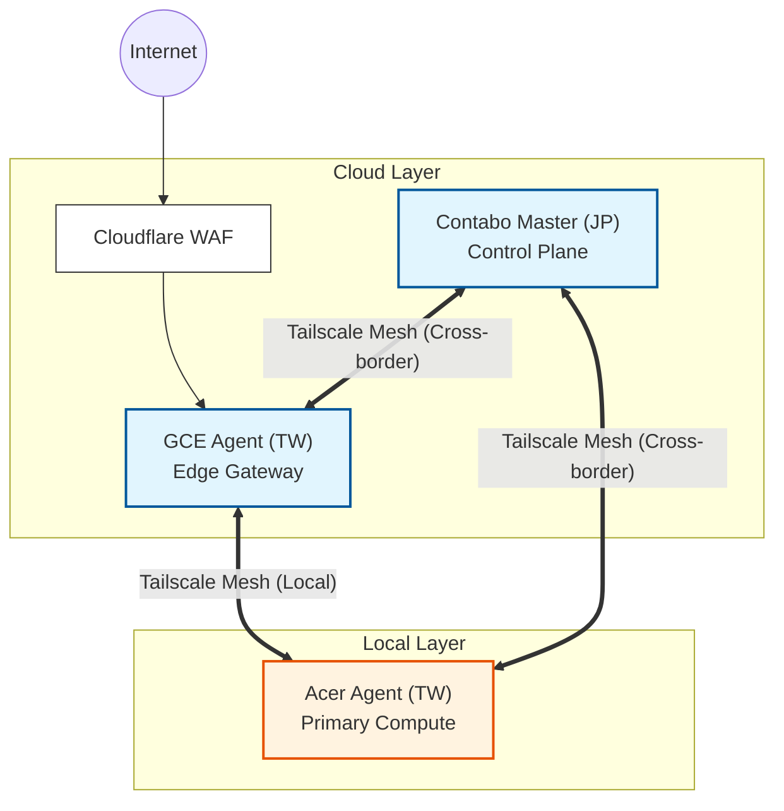

# K3han Cluster Topology (Strategy)

> **Strategic Goal**: Construct a production-grade hybrid cloud spanning Japan and Taiwan on a **~NT$800/month** cloud envelope, optimizing for high-availability management and high-IOPS data persistence.

---

## 1. Physical Topology: Hub & Spoke

K3han utilizes a **Hub & Spoke** architecture distributed across three zones, interconnected via **Tailscale VPN Overlay** to bypass NAT and cross-border firewall restrictions.

### 📊 Node Specifications & Cost Strategy

| Node Name | Role | Hardware (CPU / RAM) | Platform | Location | Est. Cost | Status |
| :--- | :--- | :--- | :--- | :--- | :--- | :--- |
| **`ct-serv-jp`** | **Control Center** | 8 vCPU / 24GB RAM (Contabo Cloud VPS 20 NVMe) | `vm` | 🇯🇵 Japan | ≈ NT$400/mo | ✅ Active |
| **`gce-agent-tw`** | **Ingress Gateway** | 2 vCPU / 1GB RAM (GCE e2-micro) | `vm` | 🇹🇼 Taiwan | ≈  NT$450/mo | ✅ Active |
| **`acer-agent`** | **Primary Worker** | i5-8500 / 16GB RAM (N4660G) | `bare-metal` | 🇹🇼 Home Lab | $0 (Sunk Cost) | ✅ Active |
| **`laptop-agent`** | **Spot Worker** | i7-4720HQ / 16GB RAM (MSI) | `bare-metal` | 🇹🇼 Home Lab | $0 (Sunk Cost) | ⚠️ Standby |
| **`desktop-agent`** | **Burst Worker** | i5-13600K / 28GB RAM (Custom) | `bare-metal` | 🇹🇼 Home Lab | $0 (Sunk Cost) | ⚠️ Standby |

> 💡 Costs are **billed totals taken from provider invoices**, not plan list prices. CSP billing adds storage, static addressing and egress on top of the VM plan, so the advertised plan price always reads low. The invoice is authoritative. Both cloud nodes bill in USD, so the NT$ figures move with FX on their own.

### Topology Visualization

---

## 2. Node Classification Dimensions

Node-lifecycle rules need a dimension that states the property they actually depend on. Two exist, both consumed by the provisioning playbook.

### 2.1 `node_platform` — hardware class, not hosting location

*   **Values**: `bare-metal` | `vm`
*   **Red Wall**: **A rule that depends on hardware class must key on `node_platform`, never on `node_provider`.** The two look interchangeable and are not: `node_provider=local` records that the box sits in the operator's house, not that it is bare metal. A VM run at home is also `local`, and would inherit every bare-metal rule by accident.

**First consumer: firmware tooling.** `fwupd` manages firmware a guest does not have — on `ct-serv-jp` it failed on every start — so the playbook removes it where `node_platform == 'vm'`. On bare metal it does a real job and stays.

**Documented exception**: `acer-agent` is bare metal and keeps `fwupd`, but the operator maintains that machine's firmware by hand. The exception is a decision, not a property the dimension can express, which is why it is recorded here rather than inferred from the inventory.

**Trade-off accepted**: a fifth per-host variable to maintain, and it takes no default — a node added without it fails the play rather than silently inheriting a lifecycle rule. Failing loudly is the point.

### 2.2 Node external addressing — a publication policy, not an inventory field

`Chorde` is a **public repository**. That makes recording a node's public address an editorial decision each time, not bookkeeping.

*   **Red Wall**: **A node's public address is recorded only where publication is deliberate. An empty value means "not recorded here" and never "none exists".** Any tooling or reader that treats absence as absence is wrong.
*   **Single location**: the values live in `inventory.ini` only. They are not restated in this document, so there is one place to keep correct.

| Node | Recorded | Reasoning |
| :--- | :--- | :--- |
| `gce-agent-tw` | ✅ Yes | It is the Cloudflare origin. The value is already public in this project's issues, and the perimeter rests on the GCP firewall allowlist rather than on the address being secret — [Ingress §3](safechord.chorde.k3han.ingress.md) exists to prove direct-to-origin is dropped. |
| `acer-agent` | ❌ Never | A dynamic residential address, which is also the operator's home. Unstable and private on two independent grounds. |
| `ct-serv-jp` | 🟡 **Open decision** | It **does** hold a static public address. Whether to publish the sole control plane's address on a public repo has not been decided. Recorded as open so the empty value does not quietly harden into "it has none". |

---

## 3. Kernel Invariants (Red Walls)

Two outages this month traced to kernel parameters that existed only on live hosts, set by hand, described in no document. This section is that description.

*   **`fs.inotify.max_user_instances` ≥ 8192.** k3s runs every component as uid 0 and this quota is per-uid, so the stock 128 saturates within minutes on a control plane. Past saturation `inotify_init()` returns `EMFILE` for every uid-0 caller including PID 1, which wedges the node **while it stays up and reachable** — nothing alerts. `ct-serv-jp` sat wedged twice, for 11 and 16 days.
*   **`net.ipv4.ip_forward = 1`.** Every Service and hostPort is a DNAT; the rewritten packet is no longer addressed to the host and must be forwarded. At `0` the SYN is accepted, rewritten, then dropped with no RST — a timeout, which Cloudflare reports as **522, not 521**. ICMP keeps answering throughout, so `ping` works while TCP times out. That fingerprint is what SafeZone#63 cost a day to read.
*   **`net.ipv4.conf.{all,default}.rp_filter = 2`** (loose, not strict). The effective value is `max(conf.all, conf.<iface>)`, so `conf.all` decides. Cross-node pod packets arrive on `tailscale0`, because Tailscale's table 52 carries the pod CIDRs, but the reverse route for their pod source in the main table is flannel's `via flannel.1`. The interface differs, so strict mode drops **every** cross-node pod packet. Loose mode is what keeps pod networking up at all; it is not a tolerance for overlay noise. Per-interface tuning is not an option: `veth*` are created and destroyed continuously. See [Pod Data Path §2.3](safechord.chorde.k3han.network.md).
*   **`net.bridge.bridge-nf-call-iptables = 1`**. Same-node pod traffic is switched at L2 inside the `cni0` bridge and never reaches IP forwarding. This setting hands it to iptables anyway, and that is the only reason NetworkPolicy sees same-node traffic at all. At `0`, same-node policy stops applying with no error, and `kubectl get netpol` still lists every policy. The key exists only while `br_netfilter` is loaded, so the module is loaded and persisted before the sysctl baseline runs.

### The invariant is on the effective value, not on the file

`sysctl --system` re-applies every file in the search path in lexical order, last write wins, and there is no notion of priority beyond the filename. **Writing a drop-in is not evidence that it won.** Assuming otherwise is the entire root cause of SafeZone#63: `gce-agent-tw`'s disk and runtime disagreed about `ip_forward` for 492 days, and the disagreement surfaced only when an unrelated reload re-asserted the image baseline.

Two consequences bind any implementation:

1.  **Order**: drop-ins are written **before** the reload, never after. A play that reloads first takes the public edge down for the duration.
2.  **Proof**: the values are read back after the reload and compared. `Chorde/cluster/k3han/ansible/privision.yaml` derives its drop-in bodies, its read-back and its expected values from one map, so the three cannot drift apart.

> ⚠️ **Enforcement gap, stated rather than assumed.** That playbook has never been executed — there is no ansible on any machine the project can currently reach, so the assert protecting these invariants does not run anywhere today. The red walls above are written intent with no live enforcement. **Chorde#15** owns closing that, and until it does, treat "the playbook provisions X" as "the playbook records X".

---

## 4. Network Latency Constraints

Geographic dispersion makes **Latency** the primary design constraint for all scheduling and data-flow decisions.

### Design Constraints (Red Walls)
*   **Cross-border latency must remain below 100ms** to support async DB replication.
*   **User-facing traffic path must stay within a single geographic region** (TW→TW) to minimize jitter.
*   **Local-node communication must be sub-millisecond** for DB Replica and Cache reads.

### Reference Measurements (Snapshot, verified via Tailscale Ping)

> These are point-in-time observations that validated the above constraints. Current values may drift; verify via `Chorde/scripts/test/` if needed.

| Source | Target | Measured Latency | Constraint Validated |
| :--- | :--- | :--- | :--- |
| **GCE (Ingress)** | **Acer (Worker)** | **~6ms** | Same-region forwarding ✅ |
| **Contabo (Master)** | **Acer (Worker)** | **~80ms** | Cross-border < 100ms ✅ |
| **Local Nodes** | **Local Nodes** | **< 1ms** | Sub-ms local access ✅ |

### Architectural Decisions Derived from Constraints
*   **Mandatory Read/Write Splitting**: Cross-border latency prohibits synchronous DB replication. On-prem applications **MUST** query local Read Replicas; writes to the JP Primary are asynchronous only.
*   **Edge Ingress Policy**: All public traffic routes through the Taiwan GCE node to leverage Google’s backbone, keeping user-facing hops within TW.

---

## 5. MVA Design Philosophy

1.  **Budget Precision**: Prioritize costs on Contabo (JP) for its superior RAM/CPU ratio while using GCE (TW) exclusively for low-latency network peering.
2.  **Heterogeneity Management**: Acknowledges that the home lab node (`acer-agent`) may go offline. Therefore, critical Control Plane services are pinned to cloud nodes, while the "Compute-Heavy Tier" remains local.
3.  **Recursive GitOps**: All cluster components are orchestrated via `gitops/k3han/root.yaml`, enabling a full "one-click" platform cold start.

---

## 6. References
*   **Networking Spec**: [Ingress & Perimeter Policy](safechord.chorde.k3han.ingress.md)
*   **Pod Data Path**: [Pod Data Path & CNI](safechord.chorde.k3han.network.md)
*   **Orchestration Spec**: [K3han Scheduling Strategy](safechord.chorde.k3han.scheduling.md)
*   **Source Code**: `Chorde/cluster/k3han/` (Ansible Playbooks)
