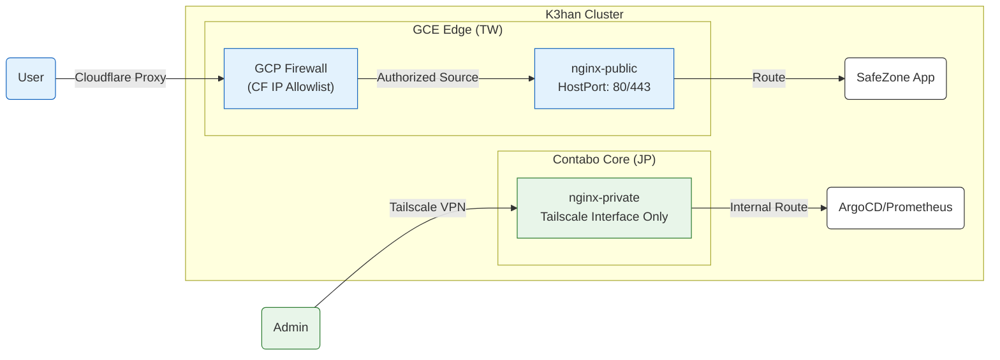

# Ingress & Network Policy (Brain)

> **Strategic Focus**: Defense in Depth, Origin Hardening, and end-to-end encryption.

---

## 1. Strategy Overview

SafeChord employs a **Stratified Ingress Strategy** combining GCP infrastructure, Cloudflare CDN, and Nginx controllers to build a layered defense system.

*   **Public Channel**: Services users via Cloudflare WAF + GCP Firewall IP locking.
*   **Private Channel**: Reserved for ops/admin, exposed ONLY via the Tailscale virtual mesh.

### Detailed Traffic Flow

---

## 2. Channel Specifications

### 2.1 Public Channel (`nginx-public`)
*   **Ingress Class**: `nginx-public` (Isolated controller).
*   **Origin Hardening**: Nodes are tagged as `ingress-public`. GCP VPC rules allow ONLY Cloudflare CIDR blocks to access 80/443, **blocking 100% of direct IP attacks**.
*   **SSL Policy**: **Full (Strict)**. End-to-end encryption with Cloudflare-issued Origin CA certificates deployed within the cluster.
*   **Security Layering**: Combines global token verification with specific **Basic Authentication** for internal mock services (e.g., `echo-server`).

### 2.2 Private Channel (`nginx-private`)
*   **Ingress Class**: `nginx-private` (Hidden by default).
*   **Listen Mode**: `HostNetwork + Tailscale`. Binds exclusively to the Tailscale virtual NIC (100.x.x.x), making it **inaccessible from the public internet**.

---

## 3. Security & Connectivity Verification Log

> 💡 **Behavioral Snapshot**: The following table consolidates the routing and authentication behaviors verified against the GitOps manifests (as of v0.3.0).

| Subject | Access Path | Access Method | Expected Behavior | Actual Result |
| :--- | :--- | :--- | :--- | :--- |
| **Origin IP** | `http://<GCE_IP>:80` | Direct Public IP | ❌ Blocked by GCP Firewall | Timeout |
| **echo-server** | `/echo` | CF Domain Name | ❌ Identity Challenge | 401 Unauthorized |
| **echo-server** | `/echo` | With Basic Auth | ✅ Successful Access | 200 OK |
| **echo-server** | `/echo?token=5566`| With Token | ✅ Higher Priority Auth | 401 (Basic Auth Required) |
| **Private UI** | `/nginx` | Tailscale IP | ✅ Authorized Access | 200 OK |

---

## 4. Operational Maintenance

*   **Protecting New Services**: Apply the `kubernetes.io/ingress.class: "nginx-public"` annotation and reference the appropriate `SealedSecret` for Basic Auth.
*   **Firewall Updates**: Ansible playbooks in `Chorde/cluster/` automate the synchronization of the GCP Firewall with Cloudflare's rotating IP ranges.

---

## 5. References
*   **Networking Submodule**: `Chorde/gitops/k3han/manifests/argocd/`
*   **GCP Config**: `Chorde/cluster/k3han/ansible/roles/firewall/`
