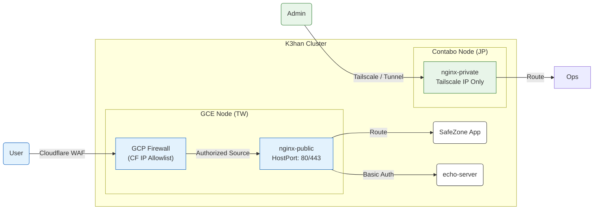

# K3han Ingress 策略 (Blueprint)

> **Blueprint (藍圖型)**：定義 K3han 叢集的流量入口控制規範。
> *重點：多層級防禦 (Defense in Depth)、來源硬化、端到端加密。*

## 1. 策略總覽 (Strategy Overview)

系統採用 **多層級入口策略 (Stratified Ingress Strategy)**，結合雲端基礎設施 (GCP)、內容傳遞網路 (Cloudflare) 與叢集控制器 (Nginx Ingress)，建構縱深防禦體系。

*   **Public Channel**: 服務一般使用者，透過 Cloudflare WAF + GCP 防火牆鎖定來源 IP。
*   **Private Channel**: 服務維運人員，僅透過 Tailscale 虛擬內網暴露。

### 流量路徑圖 (Traffic Flow)



---

## 2. 通道規格 (Channel Specifications)

### 2.1 Public Channel (`nginx-public`)
負責處理所有面向使用者的業務流量。

| 屬性 | 規格定義 | 設計決策 (Trade-off) |
| :--- | :--- | :--- |
| **Ingress Class** | `nginx-public` | 獨立 Class 以避免與管理流量爭搶資源。 |
| **Origin Hardening** | **GCP FW Tagging** | 節點標記為 `ingress-public`，僅允許 Cloudflare IP 網段存取 80/443。**阻斷直連 Origin IP 的攻擊**。 |
| **SSL 策略** | **Full (Strict)** | 端到端加密。叢集端部署 Cloudflare Origin CA 憑證，確保 Cloudflare 到 Origin 的連線完整性。 |
| **安全性** | **Stratified Defense** | 整合全域 Token (5566) 與特定服務的 **Basic Authentication** (`nginx-public/echo-basic-auth`)。 |

### 2.2 Private Channel (`nginx-private`)
負責暴露叢集內部的管理介面與監控儀表板。

| 屬性 | 規格定義 | 設計決策 (Trade-off) |
| :--- | :--- | :--- |
| **Ingress Class** | `nginx-private` | 預設不對外暴露，需明確指定 Class 才能被此 Controller 捕獲。 |
| **監聽模式** | `HostNetwork + Tailscale` | 僅綁定 Tailscale 虛擬網卡 (100.x.x.x)，**實體公網 IP 無法存取**。 |

---

## 3. 隔離與安全驗證紀錄 (Verification)

本表記載了入口安全政策的實測結果，用於確保網路邊界符合預期。

| 測試對象 | 存取路徑 | 存取方式 | 預期行為 | 實際結果 | 備註 |
| :--- | :--- | :--- | :--- | :--- | :--- |
| **Origin IP** | `http://<GCE_IP>:80` | 公網直連 | ❌ 遭 GCP 防火牆攔截 | Timeout | 驗證 Origin Hardening |
| **echo-server** | `/echo` | CF 網域名稱 | ❌ 需身分驗證 | 401 | 驗證 Basic Auth |
| **echo-server** | `/echo` | 帶 Basic Auth | ✅ 正常存取 | 200 | 驗證連線誠信 |
| **echo-server** | `/echo?token=5566` | 帶 Token | ✅ 觸發全域挑戰 | 401 | 即使帶 Token 仍需 Basic Auth |
| **Private UI** | `/nginx` | Tailscale IP | ✅ 正常存取 | 200 | 內網管理通道正常 |

---

## 4. 維運指南 (Operations)

*   **新增受保護服務**:
    ```yaml
    metadata:
      annotations:
        kubernetes.io/ingress.class: "nginx-public"
        nginx.ingress.kubernetes.io/auth-type: basic
        nginx.ingress.kubernetes.io/auth-secret: <SECRET_NAME>
    ```
*   **防火牆更新**: 若 Cloudflare 更新 IP 網段，需執行 `gce_firewall.yaml` 中定義的更新任務。