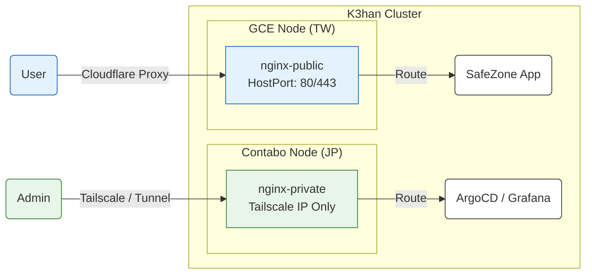

# K3han Ingress 策略 (Blueprint)

> **Blueprint (藍圖型)**：定義 K3han 叢集的流量入口控制規範。
> *重點：雙通道隔離、邊緣安全、Tailscale 整合。*

## 1. 策略總覽 (Strategy Overview)

系統採用 **雙通道入口策略 (Dual-Channel Ingress Strategy)**，透過兩個獨立的 Ingress Controller 實體，在物理與邏輯層面上嚴格隔離「公網流量」與「內網管理流量」。

*   **Public Channel**: 服務一般使用者，追求高吞吐與低延遲。
*   **Private Channel**: 服務維運人員，追求零信任安全 (Zero Trust) 與隱密性。

### 流量路徑圖 (Traffic Flow)



---

## 2. 通道規格 (Channel Specifications)

### 2.1 Public Channel (`nginx-public`)
負責處理所有面向使用者的業務流量 (North-South Traffic)。

| 屬性 | 規格定義 | 設計決策 (Trade-off) |
| :--- | :--- | :--- |
| **Ingress Class** | `nginx-public` | 獨立 Class 以避免與管理流量爭搶資源。 |
| **部署位置** | `gce-agent-tw` | **邊緣優先**。部署於台灣節點以利用 Google 骨幹網路優化亞洲區延遲。 |
| **監聽模式** | `HostPort: 80/443` | 繞過 K3s Service IP，直接綁定節點公網介面，減少一層 NAT 開銷。 |
| **SSL 策略** | **Edge Termination** | TLS 於 Cloudflare 邊緣終止。**叢集內部流量雖為 HTTP，但全程封裝於 Tailscale WireGuard 加密通道內**，確保零信任網路 (Zero Trust) 安全，同時卸載節點加解密負擔。 |
| **安全性** | Basic Hardening | 啟用 Rate Limit，隱藏 Server Header。 |

### 2.2 Private Channel (`nginx-private`)
負責暴露叢集內部的管理介面與監控儀表板。

| 屬性 | 規格定義 | 設計決策 (Trade-off) |
| :--- | :--- | :--- |
| **Ingress Class** | `nginx-private` | 預設不對外暴露，需明確指定 Class 才能被此 Controller 捕獲。 |
| **部署位置** | `ct-serv-jp` | **控制面親和**。部署於 Master 節點，與 ArgoCD/Prometheus 等管理組件物理鄰近。 |
| **監聽模式** | `HostNetwork + Tailscale` | 僅綁定 Tailscale 虛擬網卡 (100.x.x.x)，**實體公網 IP 無法存取**。 |
| **存取方式** | Tunnel / VPN Only | 必須透過 Cloudflare Tunnel 或連接 Tailscale VPN 才能訪問。 |

## 3. 隔離驗證紀錄 (Isolation Verification)

本表記載了雙通道隔離政策的實測結果，用於確保網路邊界符合預期。

| 測試來源 | 網路狀態 | URL | 預期行為 | 實際 HTTP Code | 備註 |
| :--- | :--- | :--- | :--- | :--- | :--- |
| **ct-serv-jp** | Tailscale | `http://localhost/nginx` | ✅ 回傳 private 內容 | 200 | 內部管理入口正常 |
| **ct-serv-jp** | Tailscale | `http://gce-agent-tw-ip/echo` | ✅ 正常回傳 echo | 200 | 跨節點內網互通正常 |
| **gce-agent-tw** | Tailscale | `http://localhost/echo` | ✅ 回傳 public 內容 | 200 | 業務入口正常 |
| **gce-agent-tw** | Tailscale | `http://ct-serv-jp-ip/nginx` | ❌ 不應觸發 private backend | Conn Refused | **安全防線**：嚴禁透過公網 IP 存取內網服務 |
| **gce-agent-tw** | Tailscale | `http://ct-serv-jp-vpn-ip/nginx` | ✅ 回傳 private 內容 | 200 | 跨節點經由 VPN 存取正常 |
| **User (無痕)** | 公網直連 | `http://<PRIVATE_DOMAIN>/nginx` | ❌ 預期失敗 (需認證) | 401 | 進入 Zero Trust 登入畫面 |
| **User (無痕)** | 公網直連 | `http://<PUBLIC_DOMAIN>/echo` | ✅ 正常回傳 echo | 200 | 一般使用者存取業務服務 |
| **User (Warp)** | CF Tunnel | `http://<PRIVATE_DOMAIN>/nginx` | ✅ 成功觸發 private | 200 | 授權人員經 Tunnel 存取後台 |

---

## 4. 維運指南 (Operations)

*   **新增公開服務**:
    ```yaml
    metadata:
      annotations:
        kubernetes.io/ingress.class: "nginx-public"
    ```
*   **新增管理服務**:
    ```yaml
    metadata:
      annotations:
        kubernetes.io/ingress.class: "nginx-private"
    ```
*   **除錯**:
    若發生 404，請優先檢查 `ingress.class` 是否與該服務預期的暴露層級匹配。