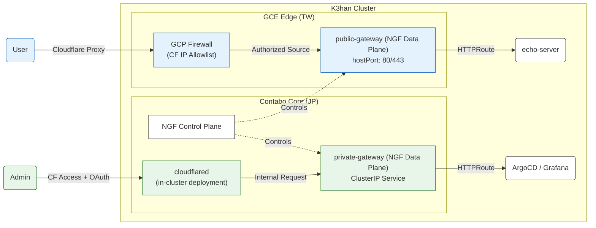

# Ingress & Network Policy (Brain)

> **Strategic Focus**: Defense in Depth, Origin Hardening, Zero-Trust private tunneling, and resource boundaries for resource-constrained edge environments.

---

## 1. Architectural Rationale & Topology

The K3han cluster employs a decoupled ingress topology separating the **Control Plane** from physically segregated **Data Planes** to achieve high availability, geo-locality, and structural security isolation.

### Rationale: Control/Data Plane Split
- **Resilience**: The central NGF Control Plane runs on the stable Contabo Master node in Japan, managing active routing rules. If a data plane node goes offline, the control plane persists.
- **Latency Invariant**: Public edge traffic is routed directly to the GCE Taiwan edge node (Taiwan-to-Taiwan traffic), keeping latency low, while administrative operations run isolated on the Japan control plane.

---

## 2. Channel Design Constraints ("Red Walls")

### 2.1 Public Channel: Edge Hardening & Protection
The public data plane accepts traffic from the public internet but operates under strict structural constraints to protect resource-constrained edge nodes and verify traffic.

#### 🟥 Constraints & Boundaries
1.  **Capacity Hardening**: 
    - The GCE Taiwan Edge is a **1GB RAM micro-instance**.
    - **Constraint**: Manifests *must* define strict Memory resource limits for the public data plane container. The proxy must be configured to fail-close or rate-limit rather than OOMing the host node.
2.  **Origin Source-Locking**:
    - **Constraint**: Direct ingress via host ports `80/443` is prohibited. GCP Firewall rules *must* permit only Cloudflare CIDR ranges.
    - **Constraint**: Real client IP extraction config within the cluster *must* align exactly with the firewall's trusted proxy ranges to prevent spoofing.
3.  **Unified SSL Termination**:
    - **Constraint**: TLS termination occurs strictly at the Gateway listener level. Individual application manifests should not contain certificates, establishing a centralized boundary for ingress SSL configurations.
4.  **Edge Defense Policies**:
    - **Constraint**: Rate-limiting and path rewrites (stripping server details) must be enforced at the gateway boundaries to protect upstream applications.

### 2.2 Private Channel: Structural Zero-Trust Isolation
The private channel handles administrative resources (ArgoCD, Grafana). It eliminates the traditional host-network exposure risk by shifting to a purely structural isolation model.

#### 🟥 Constraints & Boundaries
1.  **Zero Host-IP Bindings**:
    - **Constraint**: The private data plane must **never** run on HostNetwork or bind to a host interface (e.g., `0.0.0.0` or Tailscale overlay interface directly).
    - **Isolation**: It must be deployed as a `ClusterIP` Service, accessible only from within the Kubernetes overlay network.
2.  **Identity-Aware Ingress Tunnels**:
    - **Constraint**: Admin entry is routed exclusively via an in-cluster Cloudflare Tunnel integrated with Cloudflare Access (GitHub OAuth). 
    - **Rule**: If the identity provider authentication fails, the traffic never reaches the ClusterIP.
3.  **Break-glass Fallback**:
    - **Constraint**: In case of tunnel failures, direct administrative access must be available over the Tailscale VPN mesh via direct Pod-IP connection, bypassing the Ingress controller.

---

## 3. Security Boundary Verification Log

The following matrix documents verified boundaries enforcing the design constraints:

| Ingress Path | Entry Interface | Identity / Auth Challenge | Target Resolution | Intended Isolation |
| :--- | :--- | :--- | :--- | :--- |
| **Direct IP** | GCE Edge Host | None (Direct Network) | GCP Firewall Drop (Timeout) | Block 100% of origin-bypass attacks |
| **Public Route** | Cloudflare Proxy | Enforced Basic Auth | Upstream Pod (200 OK) | Restricted public mocks exposure |
| **Private UI** | Cloudflare Tunnel | CF Access (OAuth Challenge) | Admin Dashboard (200 OK) | Prevent unauthenticated admin panel exposure |
| **Emergency Bypass** | Tailscale NIC | None (Network Local) | Direct Pod IP (200 OK) | Break-glass admin bypass |

---

## 4. Operational Principles
- **Route Authorization**: New endpoints are registered strictly through Gateway API `HTTPRoute` resources. They must explicitly bind to either the public or private Gateway.
- **Security Audit**: Modifications to public IP scopes (e.g., Cloudflare CIDR updates) must be synchronized bi-directionally between `NginxProxy` configurations and GCP Firewall playbooks.

---

## 5. Knowledge Map References
- **Ingress Configuration Manifests**: [Chorde/gitops/k3han/manifests/](file:///home/bradyhau/workspace/SafeChord/Chorde/gitops/k3han/manifests/)
- **Infrastructure Firewall Specs**: [Chorde/cluster/k3han/ansible/gce_firewall.yaml](file:///home/bradyhau/workspace/SafeChord/Chorde/cluster/k3han/ansible/gce_firewall.yaml)
