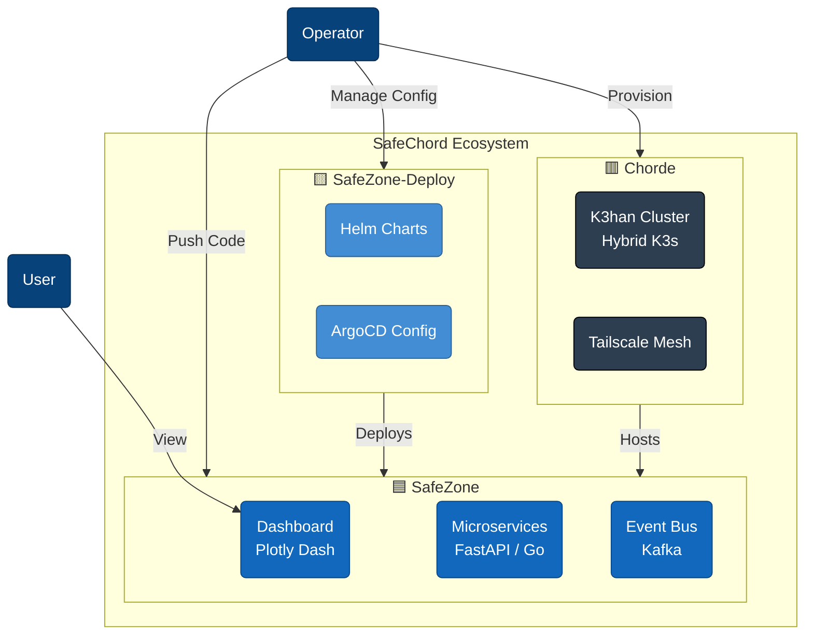

# 🎼 SafeChord

> **從事件觸發、非同步處理、資料持續性寫入，到最終的視覺化呈現。**
>
> SafeChord 是一個展示「全鏈路資料流」與「生產級維運實踐」的雲原生實驗場。我們旨在證明即使在有限資源下，依然能透過精良的架構設計，構建出一套高可用且可觀察的系統。

---

## 🏛️ 系統全景 (System Context)

SafeChord 採用嚴格的 **職責分離 (SoC)**，將系統劃分為應用、部署、平台三個解耦的維度。

---

## 🏗️ 核心架構分層 (Architectural Tiers)

| 子系統 | 定位 | 核心職責 | 導航入口 |
| :--- | :--- | :--- | :--- |
| 🟦 **SafeZone** | **應用層** (Application) | **核心業務實作**。包含模擬器、Ingestor、Worker 與 Dashboard。 | [**App Map**](safechord.safezone.md) |
| 🟨 **SafeZone-Deploy** | **部署層** (Delivery) | **配置與交付**。負責 Helm Charts 與 GitOps 晉升流程。 | [**Delivery Map**](safechord.safezone.deployment.md) |
| 🟥 **Chorde** | **平台層** (Platform) | **基礎設施與網路**。管理 K3han 混合雲叢集與 Tailscale Mesh。 | [**Platform Map**](safechord.chorde.md) |

---

## 🧪 Live Demo

> 🚧 **狀態說明**：目前展示環境進行維護調整中。

*   🚫 [SafeZone Dashboard](https://<PUBLIC_DOMAIN>/dashboard)：瀏覽經由完整資料流處理後的即時視覺化圖表。

---

## 🛠️ 技術堆疊 (Tech Stack)

| 領域 | 關鍵技術 | 用途說明 |
| :--- | :--- | :--- |
| **語言** | **Python (FastAPI)** | 業務邏輯、API、模擬器、Dashboard (Dash) |
| | **Golang** | 高吞吐量 Worker、Kafka Consumer (Franz-Go) |
| **資料** | **Kafka** | 非同步事件匯流排 (Event Bus) |
| | **PostgreSQL** | 關聯式資料儲存 (Raw Data) |
| | **Redis** | 快取與狀態控制 (Cache & State) |
| **平台** | **K3s** | 輕量級 Kubernetes 叢集 (MVA Core) |
| | **Tailscale** | 混合雲 Overlay Network (SDN) |
| | **Cloudflare** | DNS、Tunnel、Zero Trust Access |
| **維運** | **ArgoCD** | GitOps 持續交付 |
| | **KEDA** | 事件驅動自動擴縮 (Event-Driven Auto-scaling) |
| | **Helm** | 應用程式封裝 (Umbrella Charts) |

---

## 🎯 設計哲學 (Design Philosophy)

### 1. MVA (Minimum Viable Architecture)
在資源受限的環境下，我們選擇「必要的複雜度」而非「過度的工程」。每一分資源（如 800 TWD/mo 的雲端預算）都精確地分配在最能產生價值的環節上。

### 2. 環境演進策略 (Environment Evolution)
系統具備跨環境的適應力：
*   **🟢 Local**: Docker Compose 快速迭代。
*   **🟡 Preview**: K8s Namespace 自動化煙囪測試。
*   **🔴 Platform**: 混合雲 K3s 叢集 (Staging) 真實運作。

詳見 [📄 Environment Evolution](safechord.environment.md)。

### 3. KDD (Knowledge-Driven Development)
我們實踐 **「文件即代碼」**。所有的架構決策與流程皆被記錄在 `Docs/` 中，作為驅動 AI 協作的單一真理來源 (SSOT)。

---

## 🌳 知識索引與地圖

*   **[🗺️ 知識樹 (Knowledge Tree)](safechord.knowledgetree.md)**：全站導航。
*   **[🛡️ 安全架構 (Security)](safechord.security.md)**：資安與密鑰管理。
*   **[🔄 變更紀錄 (Changelog)](safechord.safezone.changelog.md)**：版本演進。

---

## 🚀 快速開始

若您是第一次來到這裡，建議閱讀順序：
1.  [**專案總覽 (本文件)**](safechord.md)
2.  [**環境演進策略**](safechord.environment.md)
3.  [**應用層資料流**](safechord.safezone.md)