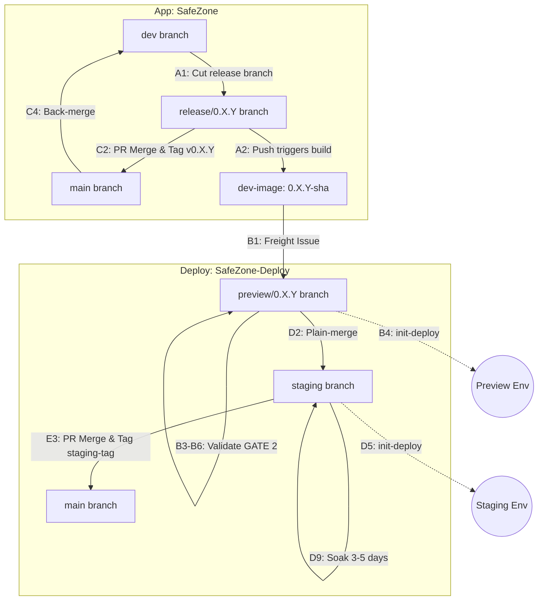

# SafeChord Unified Delivery Workflow (App + Deploy)

> **Status**: canonical (formal). Reconciled into `Docs/` as the single source of truth.
> **Scope**: end-to-end delivery across `SafeZone` (App) + `SafeZone-Deploy` (Deploy).
> **Run-tested**: `v0.3.6` shipped + promoted to staging (soaking since 2026-06-15) under the **prior 4-phase, in-place** model.
> **Decision owner**: bradyhau (Architect) · **Author**: Claude Code (Pioneer). Flow + responses reviewed by Gemini (Settler).

---

**PART I — THE FLOW** *(what you do)*

## 1. Repos, branches, tags & IssueOps touchpoints

**App `SafeZone` — GitFlow**
| Branch | Role / Action |
| :- | :- |
| `feature/*` | Feature development (local) |
| `dev` | Integration trunk — runs CI checks (GATE 1) |
| `release/*` | **Release branch — single-use** (cut from dev to isolate release; no new features. Receives hotfix PRs ➡️ runs GATE 1. Frozen/retired after tagging; post-GA defects do not reopen this branch) |
| `main` | Production trunk — merges `release/*` and tags `v*.*.*` |

**Deploy `SafeZone-Deploy` — GitOps Branches**
| Branch | Environment | ArgoCD Sync Target |
| :- | :- | :- |
| `preview/<ver>` | Dev & in-cluster validation (ephemeral; re-cut from staging) | `targetRevision=preview/<ver>` |
| `staging` | Soak + persistent showcase | `targetRevision=staging` |
| `main` | Golden config archive (history only, no sync) | — |

**Tags**: `0.X.Y-<sha>` (Preview images) · `0.X.Y` (Official App release image) · `v0.X.Y` (Git release tag) · `v0.X.Y-staging` (Rescue baseline).

**IssueOps Touchpoints** (Deploy Repo):
| Ticket Type / Label | Opened By | Machine Action | Human Action (Sign-off) |
| :- | :- | :- | :- |
| **`freight: 0.X.Y-<sha>`** | Pushing `release/0.X.Y` | Opens preview ticket, posts checklist | Validate GATE 2 ➡️ Comment evidence ➡️ Stamp `validated` |
| **`release: v0.X.Y`** | Tagging `v0.X.Y` on App | Opens staging queue ticket | Verify soak (N-cycles) ➡️ Merge `staging` to `main` ➡️ Close ticket |

## 2. The pipeline — Phase A–E

### Phase A — App integration (`SafeZone`)
- **A1.** Assert that `main` is an ancestor of `dev` (`git merge-base --is-ancestor origin/main origin/dev`) to prevent starting a new release before the prior version is back-merged. Cut the release branch: `git checkout -b release/0.X.Y` from `dev`, bump the App `VERSION` file to the target version directly on the release branch, and commit the change (e.g., `chore(release): open v0.X.Y`).
- **A2.** Push `release/0.X.Y` to remote. This push triggers `publish-candidate (GitHub Action)` to build and push the OCI images (see [ADR-1](#adr-1) for binary promotion rationale) and automatically opens the `freight: 0.X.Y-<sha>` issue.

### Phase B — Preview validation (`SafeZone-Deploy`)
- **B1.** Pick up the `freight: 0.X.Y-<sha>` issue.
- **B2.** Author configurations on the preview branch. Update target image tags and env values for both `preview` and `staging` charts (see [ADR-2](#adr-2) for atomic promotion rationale) ➡️ **push the branch**.
- **B3.** Bring up the preview infrastructure.
- **B4.** Trigger the `init-deploy.yml` action (env=preview).
- **B5.** Run preview validation probes.
- **B6.** Manual sign-off check (UI response + external connectivity).
- **B7.** Stamp the `validated` label on the freight issue.
- **B8.** Teardown the preview environment (app first, then infra).

### Phase C — Cut the release (`SafeZone`, only after `validated`)
- **C1.** Confirm the freight issue carries `validated`.
- **C2.** Merge the PR from `release/0.X.Y` to `main` (merge commit only, no squash) and cut the tag `v0.X.Y`.
- **C3.** Tagging triggers the release pipeline (GitHub Action) to `crane copy` the verified preview OCI images (tagged as `0.X.Y-<sha>`) to the production release tags (tagged as `0.X.Y`) (see [ADR-1](#adr-1)) and open the production `release: v0.X.Y` issue.
- **C4.** Back-merge `main` back to `dev` to propagate release-stage bug fixes. The release pipeline (`release.yml`) automatically opens a "back-merge v0.X.Y -> dev" PR after tagging to ensure compliance. *Invariant*: Before cutting the next `release/*` branch, `dev` must receive all outstanding release fixes (no orphaned fixes). Any fix identified after tagging (especially during soak/showcase) must be treated as a post-GA patch (Route A1-post) with its own back-merge, and must never reopen the frozen `release/*` branch.

### Phase D — Staging deploy + soak (`SafeZone-Deploy`)
- **D1.** Teardown the existing staging environment (leave external / platform services) (see [ADR-3](#adr-3) for teardown-and-rebuild rationale).
- **D2.** Plain-merge `preview/0.X.Y` directly into `staging` (no PR, no staging promotion branch) (see [ADR-4](#adr-4) for plain-merge rationale).
- **D3.** Adjust staging environment deltas (env deltas) on the `staging` branch ➡️ **push the branch**.
- **D4.** Bring up the staging infrastructure.
- **D5.** Trigger the `init-deploy.yml` action (env=staging).
- **D6.** Run `/validate-release (AI Skill)`. 
- **D7.** Human verifies (UI + external connectivity).
- **D8.** On success → confirm the checklist on the `release: v0.X.Y` issue.
- **D9.** Start soak (3–5 days).

### Phase E — Archive (`SafeZone-Deploy`)
- **E1.** Run `/validate-soak` (soak data freshness check pending design).
- **E2.** Confirm all `release: v0.X.Y` checklist items are done.
- **E3.** Tag `v0.X.Y-staging` on `staging` + PR `staging` → `main` (archive).
- **E4.** Close the `release: v0.X.Y` issue.

## 3. Exceptions & iteration *(off the happy path)*

- **Critical Defect & Border Changes (Route A — Must Return to Preview)**: If an issue is identified during preview validation, staging soak, or showcase, **direct staging commits are strictly forbidden** for resolving it. The change must go through preview validation. If a soak is already running, its 3–5 day timer **must be reset**:
  * **Sub-route A1-pre: Pre-GA Patch (Image-driven, Release Branch Open)**
    - *Scope*: Changes to App business logic or database Schema/DDL scripts (packaged inside `safezone-ops-schema`) discovered before tagging (release branch Y is still open; Y is not yet shipped).
    - *Procedure*:
      1. On the App Repo (`SafeZone`), checkout `hotfix/*` from `release/0.X.Y`, apply the fix, and PR back to `release/0.X.Y` (runs GATE 1).
      2. Merging yet-untagged changes into `release/0.X.Y` triggers the build of a new `0.X.Y-<sha>` image (version prefix `0.X.Y` remains unchanged).
      3. On the Deploy Repo (`SafeZone-Deploy`), checkout `preview/0.X.Y`, update Helm values file to target the new image tag SHA, and push.
      4. Deploy preview (GATE 2) via `init-deploy.yml (GitHub Action)` and verify via `/validate-freight (AI Skill)`.
      5. Once validated, plain-merge `preview/0.X.Y` to `staging`.
  * **Sub-route A1-post: Post-GA Patch (Image-driven, Tagged/Shipped)**
    - *Scope*: Defects discovered after the release has been officially tagged and shipped (during soak or showcase).
    - *Procedure*:
      1. **Do NOT reopen** the retired `release/0.X.Y` branch. Instead, cut a new release branch `release/0.X.(Y+1)` directly from the last GA release tag (e.g., `v0.X.Y`)—never directly from `dev`.
      2. Bump the App `VERSION` file to `0.X.(Y+1)` directly on the new branch, commit, and push.
      3. Apply the hotfix on `release/0.X.(Y+1)` via a `hotfix/*` PR (runs GATE 1). Merging triggers the build of the new `0.X.(Y+1)-<sha>` patch image.
      4. Run preview validation (GATE 2) on `preview/0.X.(Y+1)` in Deploy Repo. Once validated, merge to `staging`, **start the soak timer for Y+1**, and **close the superseded release issue for Y** (marked as `superseded-by v0.X.(Y+1)`) to prevent multiple active staging queues.
      5. Proceed through the standard C-to-E phase (tagging `v0.X.(Y+1)` and executing back-merge to `dev` at C4).
      *Note*: Multiple release branches may briefly coexist (e.g., Y in soak while Y+1 patch is in validation). Version identification and GHA pipeline triggers must leverage glob patterns (e.g., `release/0.X.*`).
  * **Sub-route A2: Config-only Border Changes**
    - *Scope*: Ingress routes, DNS, NetworkPolicy, or firewall rules configurations (no app code or schema changes).
    - *Procedure*:
      1. On the Deploy Repo (`SafeZone-Deploy`), checkout `preview/0.X.Y`, apply configuration edits, and push.
      2. Deploy preview (GATE 2) to verify connectivity and network routing gates.
      3. Once validated, plain-merge `preview/0.X.Y` to `staging`.

- **Low-Risk Configuration Hotfix (Route B — Direct Staging Patch)**: For low-risk fixes involving only environment configurations or values tweaks (e.g., non-critical environment variables, resource limits, or scaling configurations) that do not trigger Route A1 (image changes) or Route A2 (border configurations):
  1. **Procedure**: Patch directly on the `staging` branch (direct commit). ArgoCD will reconcile the change in-place. Preview validation (GATE 2) is bypassed.
  2. **Auditing Ticket**:
     - If found during active soak: Tracked directly on the existing open `release: v0.X.Y` issue.
     - If found during Showcase: Tracked on a new spontaneous configuration issue (e.g., `Deploy #12`).
  3. **Scoped Re-soak (The N-Cycles Rule)**:
     - Do not reset the 3–5 day stability soak timer. Establish a shortened observation window determined objectively by the component's execution frequency:
       - *Scheduled Tasks*: Cover at least 2 complete execution cycles (N=2) to verify trigger correctness and idempotency (e.g., **48 hours / 2 days** for a daily scheduler).
       - *Continuous Services*: Cover **6 to 12 hours** to verify steady-state resource and memory profiles.
     - Validate via `/validate-soak (AI Skill)`. If passed, tag `v0.X.Y-staging` on `staging` and PR `staging` to `main` (archive).

- **Staging Rescue**: In case of staging environment failure, refer to [7. Rollback & recovery](#7-rollback--recovery) for temporary staging rescue and forward-fix procedures.

---

**PART II — THE RATIONALE** *(why it's shaped this way)*
## 4. Deployment model — hybrid + prerequisites
*This is **not** pure GitOps. Two halves: an imperative branch-promotion flow (GitHub Actions + PRs/tags) layered on GitOps reconciliation.*

- **ArgoCD owns steady-state reconcile.** Each `deploy/<env>/app/*.yaml` is an auto-sync `Application` (`targetRevision` = the env branch; `path` = `helm-charts/safezone-<layer>` + `values-<env>.yaml`). Helm renders **inside ArgoCD**, not as a CI pre-step.
- **Ordering, by layer** — ArgoCD's health-driven sync-waves don't span Applications or reliably gate Jobs:
  - **Infra** → ArgoCD-native **sync-waves** (`ApplicationSet`: foundation `-2` → security `1` → workloads `2` → init `3`).
  - **App** → **`init-deploy.yml`** applies the Application CRs in order and gates between phases on rollout/Job health (foundation → seed-schema → core → smoke-test → seed-cases → ui → scheduler[staging]). A phased *bootstrapper + gate*, not an imperative deployer — once a CR exists, ArgoCD reconciles it. (See [ADR-5](#adr-5) for hybrid deployment rationale.)

## 5. The IssueOps spine — freight → release lifecycle
**Purpose: provenance, not access control.** The issues make a deploy an evidence-based, traceable act and a poka-yoke against basis-less deploys. They are **not** a tamper-proof gate (labels are human-mutable; no separation of duties) — they guard against the *omission*, not a deliberate bypass (solo, no adversary).

- **`freight: 0.X.Y-<sha>`** (Preview & Validation Queue):
  - **Purpose**: Serves as the tracking ticket and verification record for dev-images during preview validation (GATE 2).
  - **Lifecycle**:
    - *Opened By*: Automatically created by the `publish-candidate (GitHub Action)` pipeline when the `release/0.X.Y` branch is pushed to remote.
    - *Verification*: `init-deploy.yml` posts an automated verification checklist. The human operator runs `/validate-freight (AI Skill)` and posts the verification evidence in the comments, which stamps the `validated` label on the ticket.
    - *Closed By*: Automatically closed by the release pipeline (`release.yml`) once the release branch is promoted.
  - **Audit Policy**: The **evidence comment** posted by the human operator is the official certification of record, while the `validated` label serves as the machine-readable index required by the release pipeline to proceed.

- **`release: v0.X.Y`** (Staging & Archive Work Queue):
  - **Purpose**: Serves as the tracking ticket and audit trail for staging deployment, stability soak, and production archiving.
  - **Lifecycle**:
    - *Opened By*: Automatically created by the release pipeline when the official `v0.X.Y` tag is cut on the App Repo.
    - *Verification*: Tracks the checklists for post-deployment checks via `/validate-release (AI Skill)` and the 3–5 days soak validation.
    - *Closed By*: Manually closed by the operator after the `staging` branch is tagged (`v0.X.Y-staging`) and merged into `main` (archive).
  - **Audit Policy**: Since staging promotion bypasses pre-merge Pull Requests (see [ADR-4](#adr-4)), this issue—coupled with the git merge commit—acts as the single source of audit verification. For deploy-only configuration hotfixes during soak, changes are logged directly in the comments of this open release issue (or a spontaneous configuration issue if during Showcase) to avoid issue clutter.

## 6. Versioning — Decoupled Evolution Strategy
App and Deploy version numbers drift independently to reflect their respective release units:
*   **App Repo (`SafeZone`)**: VERSION is defined in `/SafeZone/VERSION` (governed by the corresponding GitHub Milestone aggregating the target cycle's issues). It bumps on code changes. Images are tagged with `appVersion` (e.g., `0.3.6`).
*   **Deploy Repo (`SafeZone-Deploy`)**: Config version is defined in all sub-charts' `Chart.yaml` `version` fields. It bumps globally across all charts on any config/chart change. `appVersion` in `Chart.yaml` acts as the pointer to the target App image tag. *(Note: The library chart `safezone-common` has its `appVersion` pinned to `"1.0.0"` and does not participate in this image tag drifting.)*
*   **Bumping Matrix** (Assuming starting baseline is App `0.3.6` / Deploy `0.3.6`):
    1.  **Co-change (Scenario A)**: App code changes, releasing `0.3.7`. Deploy config also changes to support this new feature. Deploy bumps its chart `version` to `0.3.7` and updates `appVersion` to `"0.3.7"`.
    2.  **Deploy-only Fix (Scenario B)**: App stays frozen at `0.3.7`. Deploy configuration requires a patch (e.g., env variables). Deploy bumps chart `version` to `0.3.8` while keeping `appVersion` pinned to `"0.3.7"`.
    3.  **App-only Fix (Scenario C)**: App code changes, releasing `0.3.8`. Deploy config has no structural changes. To point to the new image, Deploy bumps chart `version` to `0.3.9` and updates `appVersion` to `"0.3.8"`.
*   **`VERSION` bump discipline**: 
    - At the start of a release cycle (Step A1), the App `VERSION` file is bumped directly on the `release/*` branch to set the target version (e.g., `0.3.7`), ensuring a frozen-pin semantic for the release codebase. All dev images generated during this cycle will use this version as a prefix (`0.3.7-<sha>`).
    - **Guards**: To prevent human error, the release pipeline (`release.yml`) automatically fails if the finalized Git tag (e.g., `v0.3.7`) does not match the content of the App `VERSION` file. Additionally, the release is always cut from a dedicated `release/*` branch (acting as a **frozen pin** for that version's codebase), guaranteeing that no unvalidated changes bypass the release gate.

## 7. Rollback & recovery
*   **Forward-fix only**: The project does not support automated rollback; issues are addressed by shipping forward fixes.
*   **Staging Rescue**: In case of staging environment failure, the ArgoCD `targetRevision` may be temporarily pinned to a known good release tag (`v0.X.Y-staging`) to restore showcasing functionality while a forward-fix is prepared.

---

**APPENDIX**

## A. Architectural Decision Records (Key Rationales)

### ADR-1
**Binary Promotion via Crane Copy**
* **Decision**: Release artifacts are promoted directly using `crane copy` (digest-identical preservation) rather than rebuilding from source code during the release phase.
* **Rationale**: Rebuilding from source code during release can introduce subtle environmental or dependency drift (e.g., floating base tags, updated upstream packages), resulting in binaries that are not identical to what was verified in Preview. Replicating the exact verified container image digest via `crane copy` (copying the image digest from the preview `0.X.Y-<sha>` tag directly to the official `0.X.Y` release tag) guarantees that "what was tested is exactly what is shipped."

### ADR-2
**Atomic Configuration Promotion**
* **Decision**: Feature-specific configurations for all environments (both `preview` and `staging` values) are declared and modified together on the `preview/0.X.Y` branch, then promoted as an atomic commit block.
* **Rationale**: In a multi-branch GitOps workflow, updating environment-specific values (like `values-staging.yaml`) only when switching to that environment's branch increases the likelihood of human error (e.g., forgetting to add a new environment variable required by the new release). Defining all configurations upfront on the pre-release branch (preview) ensures that configuration dependencies are atomic, tested together, and automatically promoted during the merge, significantly reducing post-merge drift and deployment failures.

### ADR-3
**Teardown-and-Rebuild Promotion for Staging**
* **Decision**: Staging deployments perform a full infrastructure teardown before rebuilding, rather than an in-place rolling update.
* **Rationale**: In the `v0.x` stage, breaking changes to database schemas and platform networking are frequent. Writing backward-compatible database migrations and rolling deployment scripts for every single release introduces high maintenance overhead. A deterministic teardown-and-rebuild provides a clean slate, eliminates configuration drift, recovers in under 10 minutes, and offers the highest reliability for showcase demo stability.

### ADR-4
**Plain-Merge Promotion to Staging**
* **Decision**: Merging `preview/0.X.Y` config into the `staging` branch is done via plain-merge without opening a Pull Request (PR) for code review.
* **Rationale**: The preview configurations are already thoroughly validated in cluster during GATE 2 (including human connectivity and automation checklists). At our current solo-developer scale, requiring a formal GitHub PR for every environment promotion creates unnecessary process friction. The audit trail is fully preserved via the merge commit history and the IssueOps release ticket.

### ADR-5
**Hybrid Deployment (Phased Bootstrapper via init-deploy)**
* **Decision**: We employ a hybrid deployment model: declarative convergence (ArgoCD) for steady-state infrastructure and application deployments, combined with an imperative workflow runner (`init-deploy.yml`) to orchestrate phased deployments and gate release stages based on Job health.
* **Rationale**: A pure ArgoCD path using sync-waves and Job hooks was previously attempted and failed. ArgoCD's wave progression and hook completion rely on its internal Job health evaluation, which often reports success and proceeds before the Jobs actually complete execution. The hybrid runner separates declarative state convergence from imperative execution gating, providing a reliable orchestration gate for database schema seeding and smoke tests.
