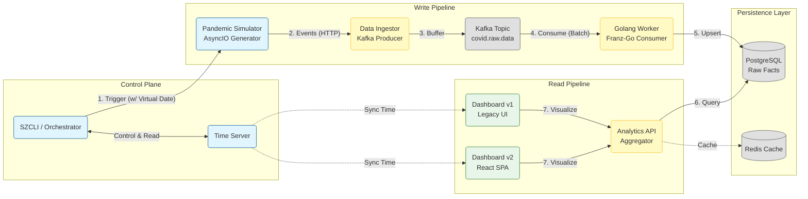

# 🗺️ SafeZone Application Map

> **Type**: Map (Architectural Overview)
> **Context**: An event-driven, distributed pandemic simulation and analysis engine.

---

## 1. System Context & Data Flow

SafeZone is designed as a unidirectional data processing pipeline. Data is generated by simulators, buffered for resilience, and persisted into structured views for high-performance querying.

---

## 2. Microservices Index

SafeZone adheres to the **Separation of Concerns (SoC)** principle, decoupling logic into specialized microservices.

### 2.1 Write Pipeline
Responsible for high-concurrency data ingestion and persistence.

| Service | Role | Key Tech | Documentation |
| :--- | :--- | :--- | :--- |
| **Pandemic Simulator** | **Source** | AsyncIO, httpx, Pandas | [Blueprint](safechord.safezone.service.pandemicsimulator.md) |
| **Data Ingestor** | **Gateway** | FastAPI, aiokafka | [Blueprint](safechord.safezone.service.dataingestor.md) |
| **Worker (Golang)** | **Consumer** | Golang, Franz-Go | [Blueprint](safechord.safezone.service.worker.md) |

### 2.2 Read Pipeline
Responsible for data aggregation and user presentation.

| Service | Role | Key Tech | Documentation |
| :--- | :--- | :--- | :--- |
| **Analytics API** | **Aggregator** | FastAPI, Redis, SQLAlchemy | [Blueprint](safechord.safezone.service.analyticsapi.md) |
| **Dashboard (v1)** | **Visualizer** | Plotly Dash, httpx | [Blueprint](safechord.safezone.service.dashboard.md) |
| **Dashboard v2** | **Visualizer (SPA)** | React, MapLibre GL, Recharts | [Blueprint](safechord.safezone.service.dashboard-v2.md) |

### 2.3 Toolkit & Orchestration
Supporting components that maintain the simulation's state and operation.

| Component | Role | Key Tech | Documentation |
| :--- | :--- | :--- | :--- |
| **SZCLI** | **Controller** | Python Typer | [Reference](safechord.safezone.toolkit.cli.md) |
| **Time Server** | **Global Clock** | FastAPI | [Blueprint](safechord.safezone.toolkit.timeserver.md) |

---

## 3. Key Architectural Characteristics

1.  **Event-Driven Decoupling**:
    *   The write path is entirely decoupled via **Kafka**. The Ingestor (Gateway) and Worker (Processor) scale independently.
    *   **Value**: During traffic spikes, the Ingestor only handles rapid reception. The Worker smooths out database writes (Load Leveling) based on processing capacity.

2.  **Polyglot Implementation**:
    *   **Python**: Leveraged for complex domain logic (Simulator, API) and rapid UI iteration (Dashboard).
    *   **Golang**: Utilized for compute-intensive, high-throughput tasks (Worker) to maximize resource efficiency.

3.  **Time Awareness**:
    *   SafeZone features a "Virtual Timeline." All time-sensitive components (Simulator, Dashboard) reference the `Time Server` rather than the system clock.
    *   **Value**: Enables "Time Travel" simulation (fast-forwarding or pausing pandemic progression) for debugging and forecasting.

---

## 4. Operational Links

*   **Deployment Architecture**: [Deployment & Operations](safechord.safezone.deployment.md)
*   **CI/CD Pipeline**: [Unified Delivery Workflow](safechord.safezone.delivery.workflow.md)
*   **API Specifications**: Refer to the **Interface** section within each individual Service Blueprint.
