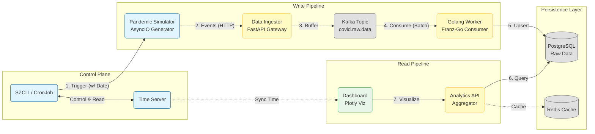

# 🗺️ SafeZone 應用架構地圖 (Map)

> **Map (地圖型)**：SafeZone 業務邏輯與資料流的全景視圖。
> *定位：基於事件驅動 (Event-Driven) 的分散式疫情模擬系統。*

---

## 1. 系統全景與資料流 (System Context & Data Flow)

SafeZone 的核心是一個單向流動的資料處理管道 (Pipeline)。資料從模擬器產生，經過緩衝與處理，最終沉澱為可供查詢的視圖。

---

## 2. 微服務導航 (Microservices Index)

SafeZone 採用 **職責分離 (SoC)** 原則，將系統劃分為以下獨立服務：

### 2.1 寫入管道 (Write Pipeline)
負責高併發數據的接收與落地。

| 服務名稱 | 職責 | 關鍵技術 | 文件連結 |
| :--- | :--- | :--- | :--- |
| **Pandemic Simulator** | **Source** | 模擬資料生成源，支援 AsyncIO 高併發發送。 | [Blueprint](safechord.safezone.service.pandemicsimulator.md) |
| **Data Ingestor** | **Gateway** | 寫入入口，負責驗證並快速卸載至 Kafka。 | [Blueprint](safechord.safezone.service.dataingestor.md) |
| **Worker (Golang)** | **Consumer** | 資料處理核心，負責從 Kafka 批次寫入資料庫。 | [Blueprint](safechord.safezone.service.worker.md) |

### 2.2 讀取管道 (Read Pipeline)
負責數據的聚合查詢與呈現。

| 服務名稱 | 職責 | 關鍵技術 | 文件連結 |
| :--- | :--- | :--- | :--- |
| **Analytics API** | **Reader** | 提供聚合查詢 API，整合快取版本控制。 | [Blueprint](safechord.safezone.service.analyticsapi.md) |
| **Dashboard** | **Visualizer** | 前端視覺化，具備時光旅行感知能力。 | [Blueprint](safechord.safezone.service.dashboard.md) |

### 2.3 工具與支撐 (Toolkit)
輔助系統運作的基礎組件。

| 組件名稱 | 職責 | 關鍵技術 | 文件連結 |
| :--- | :--- | :--- | :--- |
| **SZCLI** | **Orchestrator** | 維運指揮官，用於觸發模擬與驗證系統。 | [Reference](safechord.safezone.toolkit.cli.md) |
| **Time Server** | **Clock** | 全域虛擬時鐘，支援時間暫停與加速。 | [Blueprint](safechord.safezone.toolkit.timeserver.md) |

---

## 3. 架構特徵 (Architectural Characteristics)

1.  **Event-Driven (事件驅動)**:
    *   寫入路徑透過 **Kafka** 完全解耦。Ingestor (Gateway) 與 Worker (Processor) 可以獨立擴展。
    *   **優勢**: 當模擬數據爆量時，Ingestor 僅需負責快速接收，後端 DB 不會被直接擊穿，由 Worker 依據消費能力平滑寫入 (Load Leveling)。

2.  **Polyglot (多語言)**:
    *   **Python**: 用於複雜邏輯 (Simulator, API) 與快速迭代 (Dashboard)。
    *   **Golang**: 用於計算密集與高吞吐場景 (Worker)，榨取每一分 CPU 效能。

3.  **Time-Aware (時間感知)**:
    *   系統內建「虛擬時間軸」。所有組件 (Simulator, Dashboard) 皆參考 `Time Server` 而非物理時間。
    *   **優勢**: 允許開發者「快轉」疫情發展，或「暫停」時間以進行 Debug。

---

## 4. 快速連結 (Quick Links)

*   **部署架構**: [Helm Charts & KEDA](safechord.safezone.deployment.charts.md)
*   **開發流程**: [CI/CD Workflow](safechord.safezone.workflow.md)
*   **API 規格**: 請參閱各服務 Blueprint 內的 Interface 定義。
