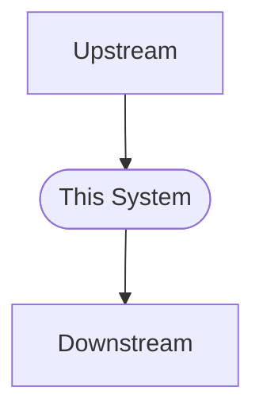

# [System/Module Name] (Map)

> **Type**: Map (Architectural Overview & Navigation)
> **Focus**: System boundaries, high-level data flow, and knowledge discovery.
> **Constraint**: Do NOT include implementation details (specs/schemas) here.

---

## 1. System Context & Visualization
*(Required)*
*   **Definition**: A one-sentence definition of what this system is.
*   **Visual Context**: Use Mermaid diagrams to show the system boundary and high-level interactions.

## 2. Component Index (Navigation)
*(Required)*
Provide an entry point to child blueprints and related workflows.

| Component / Module | Type | Description | Link |
| :--- | :--- | :--- | :--- |
| **[Service A]** | 🔵 Blueprint | Core service for X... | [Link] |
| **[Workflow B]** | 📜 Script | Deployment or CI process... | [Link] |
| **[Decision C]** | 🧠 Brain | Major architectural ADR... | [Link] |

## 3. Key Architectural Characteristics
*(Recommended)*
Describe system-wide properties that span multiple components (e.g., Event-driven, Stateless, Multi-tenant).

## 4. Reading Path
*(Recommended)*
Guidance for different personas (e.g., developers vs. operators).

*   **For Developers**: Start with [Blueprint X], then follow [Workflow Y].
*   **For Operators**: Focus on [Infrastructure Map Z].

## 5. Evolution & Status
*(Optional)*
*   Current Status (e.g., Beta, Production).
*   High-level roadmap themes or links to the GitHub Project Board.
