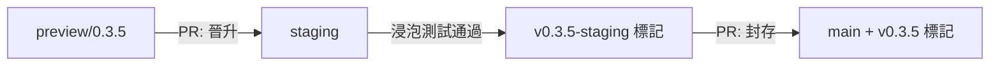

# SafeZone 部署與 GitOps 工作流程（v2）

本文件統整了 `SafeZone-Deploy`（設定）儲存庫的作業邏輯。我們遵循 **GitOps** 模型，將 Git 儲存庫的狀態視為叢集期望狀態的唯一真相來源。

## 1. 核心原則

為了在 **MVA（最小可行架構）** 框架下達到生產等級的交付穩定性，我們結合了兩種範式：

*   **宣告式穩定狀態（ArgoCD）**：負責將 YAML 從 Git 持續同步到叢集，並監控資源漂移。
*   **階段式命令式編排（GitHub Actions）**：負責執行有狀態任務，例如資料種子植入、健康探測及環境生命週期管理。
*   **務實的復原策略**：在 0.x 版本的快速迭代期間，我們避免過度設計自動化復原腳本。取而代之的是利用 **Git Tagging** 建立環境的「復原基準點」。

---

## 2. 分支晉升模型

我們移除了多餘的 `dev` 分支，改採每個分支對應一個**生命週期階段**的模型：

| 分支名稱 | 生命週期階段 | 標記策略 | ArgoCD 同步 |
| :--- | :--- | :--- | :--- |
| **`preview/<版本號>`** | **開發與驗證** | **無標記**（隨 PR 銷毀） | 自動更新 `safezone-preview` |
| **`staging`** | **浸泡測試與展示** | **`v0.x.y-staging`**（基準點） | 自動同步 `safezone`（Staging） |
| **`main`** | **版本封存（金版）** | **`v0.x.y`**（正式發行版） | 手動封存（環境無關） |

### 為何 Preview 不建立標記？
`preview/` 分支是**暫時性**的。其生命週期與 Pull Request 綁定。為草稿工作建立標記只會讓 Git 歷史充滿「垃圾」。Preview 環境會在分支合併或關閉後立即銷毀。

---

## 3. 標準作業程序（SOP）

### 情境 A：功能開發與 Preview 驗證
1.  **分支建立**：從 `staging` 建立 `preview/<版本號>`（例如 `preview/0.4.0`）。
2.  **設定調整**：修改 Helm chart 或更新映像檔標籤。
3.  **驗證**：GitHub Actions 自動觸發同步至 `safezone-preview` 命名空間，進行端到端驗證。

### 情境 B：晉升至 Staging
1.  **晉升 PR**：從 `preview/<版本號>` 發起 PR 至 `staging`。
2.  **環境適配**：針對 Staging 環境調整設定（例如從臨時的 mock 伺服器切換至平台級服務）。
3.  **晉升決策**：合併 PR 即代表該決策的正式記錄，並觸發 Staging 編排管線。

### 情境 C：基準點檢查點與封存
1.  **浸泡測試**：在 Staging 中運行該版本 3-5 天，監控穩定性問題。
2.  **標記（檢查點）**：測試通過後，手動為 `staging` 分支加上 `v0.x.y-staging` 標記。
    *   *價值*：若後續版本導致 Staging 故障，可立即將 ArgoCD 的 `targetRevision` 指向此標記進行復原。
3.  **封存**：將 `staging` 合併至 `main`，並套用最終正式版本標記 `v0.x.y`。

---

## 4. GitHub Actions 編排器（階段式）

我們的 `init-deploy.yml` 管線分為多個明確階段，以確保部署順序。

### 階段 0：預先驗證
*   執行 `helm template` 渲染，防止格式錯誤的 YAML 進入叢集，做到早期失敗偵測。

### 階段 1-5：命令式編排
1.  **基礎設施就緒檢查**：主動探測 PostgreSQL 與 Kafka 連線（例如 `kubectl exec ... ping`）。
2.  **資料種子植入**：觸發 `safezone-seed` Job 並等待其完成。
3.  **應用程式同步**：確認 API 健康檢查端點回應 200 OK。

### 階段 6：環境維護（僅 Staging）
*   **排程器整合**：啟用 `safezone-scheduler`（CronJob）以產生每日模擬資料，維持展示用環境的真實性。

---

## 5. 架構決策記錄（ADR）

### 為何移除 `dev` 分支？
在 MVA 專案中，`dev` 分支只增加合併的負擔卻無法提供整合價值。v2 專注於**「透過 PR 晉升」**，確保每次環境轉換都有明確的稽核軌跡。

### 為何允許功能分支直接合併至 Staging？
Staging 是一個**活躍的整合環境**。對於基礎設施層級的調整（例如 NetworkPolicy 調校），允許直接在 Staging 上作業可避免不必要的「Preview → Staging」跳躍延遲。

### 為何採用人工標記復原？
在變動頻繁的 0.x 階段，自動化復原腳本常因頻繁的綱要變更而失效。使用 **Staging 標記**作為基準點是最具成本效益且可靠的折衷方案——它承認風險的存在，並利用 Git 原生的機制來解決問題。