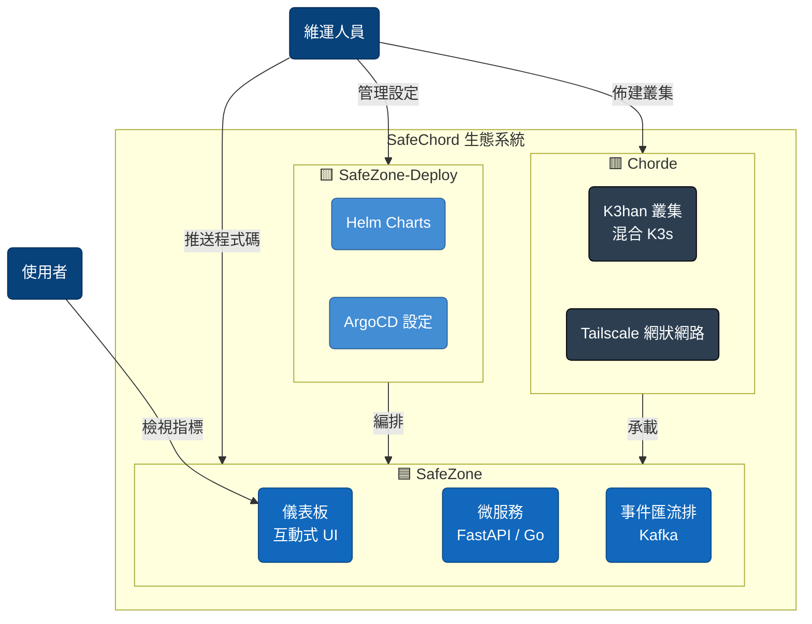

# 🎼 SafeChord 生態系統

> **從事件觸發、非同步處理，到持久儲存與互動式視覺化。**
>
> SafeChord 是一個生產等級的「雲原生實驗室」，旨在展示端到端的資料流管線與現代 SRE 實踐。我們的目標是證明，即使在資源受限的環境下，透過有紀律的架構設計，依然能實現高可用性與可觀測性。

---

## 🏛️ 系統脈絡

SafeChord 遵循嚴格的**關注點分離（SoC）**，將生態系統解耦為三個主要維度：應用（Application）、交付（Delivery）與平台（Platform）。

---

## 🏗️ 架構層級

| 層級 | 定位 | 核心職責 | 導航 |
| :--- | :--- | :--- | :--- |
| 🟦 **SafeZone** | **應用** | 業務邏輯實作，包含模擬器、資料攝取閘道與資料工作者。 | [**應用地圖**](safechord.safezone.md) |
| 🟨 **SafeZone-Deploy** | **交付** | 打包與生命週期管理。掌管 Helm chart 與 GitOps 提升流程。 | [**交付地圖**](safechord.safezone.deployment.md) |
| 🟥 **Chorde** | **平台** | 基礎設施與網路。管理混合 K3han 叢集與 Tailscale 覆蓋網狀網路。 | [**平台地圖**](safechord.chorde.md) |

---

## 🛠️ 技術堆疊

| 領域 | 核心技術 | 用途 |
| :--- | :--- | :--- |
| **語言** | **Python (FastAPI)** | 業務邏輯、聚合 API、模擬器、儀表板 UI。 |
| | **Golang** | 高吞吐量資料工作者、Franz-Go 消費者。 |
| **資料** | **Kafka** | 非同步事件匯流排，實現系統解耦。 |
| | **PostgreSQL** | 疫情事實的關聯式儲存（已支援 PostGIS）。 |
| | **Redis** | 多層快取與分散式狀態控制。 |
| **平台** | **K3s** | 輕量級 Kubernetes 發行版，適用於混合環境。 |
| | **Tailscale** | 點對點 SDN，實現多雲節點連線。 |
| | **Cloudflare** | DNS 管理、Tunnel 與 Zero Trust 存取控制。 |
| **維運** | **ArgoCD** | 宣告式 GitOps，實現持續交付。 |
| | **KEDA** | 基於 Kafka 消費者延遲的事件驅動自動伸縮。 |

---

## 🎯 設計哲學

### 1. MVA（最小可行架構）
在資源受限的環境中，我們優先考慮「必要的複雜度」而非「過度設計」。每一份資源都精準分配給能帶來最高架構價值的區塊。

### 2. 環境演進
系統設計為環境無關的適應性：
*   **🟢 本地**：透過 Docker Compose 快速迭代。
*   **🟡 預覽**：在臨時 K8s 命名空間中進行自動化冒煙測試。
*   **🔴 平台**：在混合 K3han 叢集（Staging）上即時運作。

### 3. KDD（知識驅動開發）
我們實踐**「文件即程式碼庫」**。所有架構決策與工作流程都記錄在此知識庫中，作為單一事實來源（SSOT），驅動 AI 與人類協作。

---

## 🛣️ 策略演進（合併路線圖）

> **「可靠性不是意外，而是一項功能。最佳化不是猜測，而是一種測量。」**

SafeChord 透過有紀律的階段演進，從穩定的基礎邁向可量測的效能。

| 階段 | 主題 | 目標 |
| :--- | :--- | :--- |
| **v0.3.x** | **穩定化** | ✅ **已完成**。統一微服務腳手架，補齊單元測試。 |
| **v0.3.5** | **現代化** | **當前階段**。遷移至英文優先的文件與 React SPA 前端。 |
| **v0.4.x** | **架構 TDD** | 定義服務水準目標（SLO），建立架構基線。 |
| **v0.5.x** | **擴展** | 根據收集到的指標，針對性最佳化吞吐量瓶頸。 |

*關於細項任務追蹤、進行中的 Sprint 與即時狀態，請參閱我們的 [**GitHub Issues 看板**](https://github.com/SafeChord/SafeZone/issues)。*

---

## 🚀 入門指引

如果您是第一次造訪，建議依照以下路徑閱讀：
1.  **系統概覽**（本文件）
2.  [**環境演進**](safechord.environment.md)
3.  [**知識樹**](safechord.knowledgetree.md)