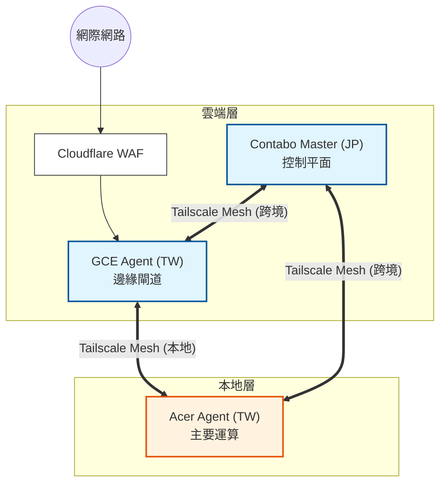

# K3han 叢集拓撲（策略）

> **戰略目標**：以總預算 **NT$800/月** 建置跨越日本與台灣的生產級混合雲，針對高可用管理與高 IOPS 資料持久性進行最佳化。

---

## 1. 實體拓撲：Hub & Spoke

K3han 採用跨三個可用區的 **Hub & Spoke** 架構，透過 **Tailscale VPN Overlay** 互連，以繞過 NAT 與跨境防火牆限制。

### 📊 節點規格與成本策略

> 💡 **基礎設施概覽**：下表彙整了物理節點配置（截至 v0.3.0）。雖然 GitOps 管理狀態，但此表提供硬體能力的即時背景資訊。

| 節點名稱 | 角色 | 硬體 (CPU / RAM) | 位置 | 估算成本 | 狀態 |
| :--- | :--- | :--- | :--- | :--- | :--- |
| **`ct-serv-jp`** | **控制中心** | 6 vCPU / 12GB RAM (Contabo VPS) | 🇯🇵 日本 | ~ NT$350/月 | ✅ 運作中 |
| **`gce-agent-tw`** | **入口閘道** | 2 vCPU / 1GB RAM (GCE e2-micro) | 🇹🇼 台灣 | ~ NT$450/月 | ✅ 運作中 |
| **`acer-agent`** | **主要工作者** | i5-8500 / 16GB RAM (N4660G) | 🇹🇼 自建機房 | $0 (沈沒成本) | ✅ 運作中 |
| **`laptop-agent`** | **備用工作者** | i7-4720HQ / 16GB RAM (MSI) | 🇹🇼 自建機房 | $0 (沈沒成本) | ⚠️ 待命中 |
| **`desktop-agent`** | **突發工作者** | i5-13600K / 28GB RAM (Custom) | 🇹🇼 自建機房 | $0 (沈沒成本) | ⚠️ 待命中 |

### 拓撲視覺化

---

## 2. 網路延遲約束

地理分散使得**延遲**成為所有排程與資料流決策的主要設計限制。

### 設計限制（紅線）
*   **跨境延遲必須低於 100ms**，以支援非同步資料庫複寫。
*   **面向使用者的流量路徑必須保持在單一地理區域內**（TW→TW），以最小化抖動。
*   **本地節點通訊必須低於毫秒等級**，以支援資料庫複本與快取讀取。

### 參考測量值（快照，經 Tailscale Ping 驗證）

> 以下是確認上述限制的即時觀測值。當前數值可能有所變動；必要時請透過 `Chorde/scripts/test/` 驗證。

| 來源 | 目標 | 測得延遲 | 驗證的限制 |
| :--- | :--- | :--- | :--- |
| **GCE (入口)** | **Acer (工作者)** | **~6ms** | 同區域轉發 ✅ |
| **Contabo (主控)** | **Acer (工作者)** | **~80ms** | 跨境 < 100ms ✅ |
| **本地節點** | **本地節點** | **< 1ms** | 本地存取低於毫秒 ✅ |

### 由限制推導出的架構決策
*   **強制讀寫分離**：跨境延遲禁止同步資料庫複寫。本地應用程式**必須**查詢本地讀取複本；僅能非同步寫入日本 Primary 節點。
*   **邊緣入口政策**：所有公開流量均經由台灣 GCE 節點路由，以利用 Google 骨幹，確保使用者端延遲保持在台灣境內。

---

## 3. MVA 設計哲學

1.  **預算精準**：優先將成本投入 Contabo (JP) 以獲得較佳的 RAM/CPU 比例，同時僅將 GCE (TW) 用於低延遲網路對等連線。
2.  **異質性管理**：認知到自建機房節點（`acer-agent`）可能離線。因此，關鍵控制平面服務固定部署於雲端節點，而「運算密集型層」保留在本地。
3.  **遞迴 GitOps**：所有叢集元件均透過 `gitops/k3han/root.yaml` 編排，實現完整的「一鍵」平台冷啟動。

---

## 4. 參考文件
*   **網路規格**：[入口與邊界政策](safechord.chorde.k3han.ingress.md)
*   **編排規格**：[K3han 排程策略](safechord.chorde.k3han.scheduling.md)
*   **原始碼**：`Chorde/cluster/k3han/` (Ansible Playbooks)