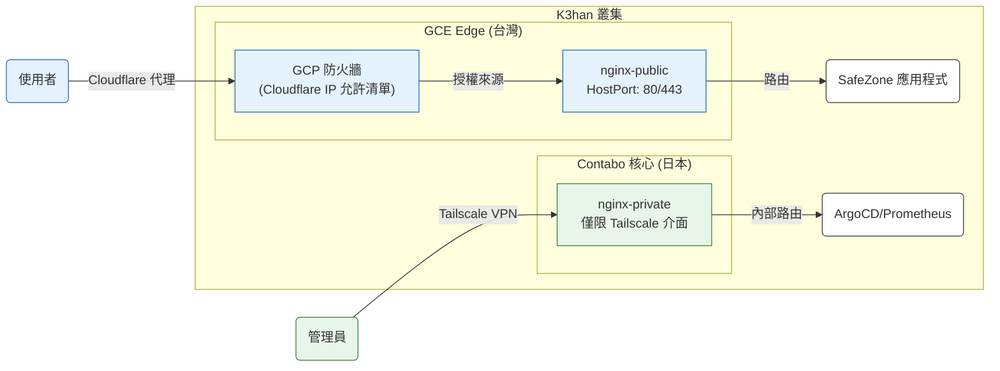

# Ingress 與 Network Policy（指導方針）

> **策略重點**：縱深防禦、源站強化以及端到端加密。

---

## 1. 策略總覽

SafeChord 採用 **分層 Ingress 策略**，整合 GCP 基礎設施、Cloudflare CDN 與 Nginx 控制器，打造多層防禦體系。

*   **公開通道**：透過 Cloudflare WAF 搭配 GCP Firewall IP 限制提供服務。
*   **私有通道**：保留給維運管理用途，僅透過 Tailscale 虛擬網格暴露。

### 詳細流量架構

---

## 2. 通道規格

### 2.1 公開通道（`nginx-public`）
*   **Ingress Class**：`nginx-public`（獨立控制器）
*   **源站強化**：節點標記為 `ingress-public`。GCP VPC 規則只允許 Cloudflare CIDR 區段存取 80/443 埠，**100% 阻擋直接 IP 攻擊**。
*   **SSL 政策**：**完全（嚴格）**。叢集內部署 Cloudflare 簽發的 Origin CA 憑證，實現端到端加密。
*   **安全分層**：結合全域 Token 驗證與特定 **基礎認證**，保護內部模擬服務（例如 `echo-server`）。

### 2.2 私有通道（`nginx-private`）
*   **Ingress Class**：`nginx-private`（預設隱藏）
*   **監聽模式**：`HostNetwork + Tailscale`。僅綁定 Tailscale 虛擬網路卡（100.x.x.x），**無法從公開網際網路存取**。

---

## 3. 安全與連線驗證紀錄

> 💡 **行為摘要**：下表彙整了根據 GitOps 配置檔案（截至 v0.3.0）驗證的路由與身分驗證行為。

| 項目 | 存取路徑 | 存取方式 | 預期行為 | 實際結果 |
| :--- | :--- | :--- | :--- | :--- |
| **源站 IP** | `http://<GCE_IP>:80` | 直接公開 IP | ❌ 被 GCP 防火牆阻擋 | 逾時 |
| **echo-server** | `/echo` | 透過 Cloudflare 域名 | ❌ 身分驗證挑戰 | 401 未授權 |
| **echo-server** | `/echo` | 使用基礎認證 | ✅ 成功存取 | 200 OK |
| **echo-server** | `/echo?token=5566`| 使用 Token | ✅ 優先權較高 | 401（需要基礎認證）|
| **私有管理介面** | `/nginx` | 透過 Tailscale IP | ✅ 授權存取 | 200 OK |

---

## 4. 維運管理

*   **保護新服務**：請套用 `kubernetes.io/ingress.class: "nginx-public"` 註解，並引用對應的 `SealedSecret` 設定基礎認證。
*   **防火牆更新**：`Chorde/cluster/` 中的 Ansible playbook 會自動同步 GCP 防火牆規則與 Cloudflare 變動的 IP 區段。

---

## 5. 參考資料
*   **網路子模組**：`Chorde/gitops/k3han/manifests/argocd/`
*   **GCP 配置**：`Chorde/cluster/k3han/ansible/roles/firewall/`