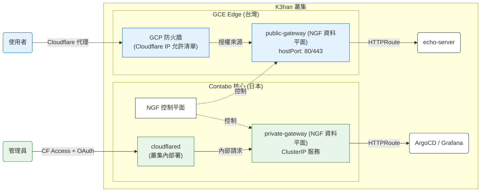

# Ingress 與 Network Policy（指導方針）

> **策略重點**：縱深防禦、源站強化、零信任私有隧道，以及針對資源受限邊緣環境的資源邊界。

---

## 1. 架構合理性與拓撲

K3han 叢集採用解耦的 Ingress 拓撲，將**控制平面**與物理隔離的**資料平面**分離，以實現高可用性、地理在地性與結構性安全隔離。

### 架構合理性：控制／資料平面分離
- **彈性**：核心 NGF 控制平面運行於日本穩定的 Contabo 主節點，管理活躍的路由規則。若資料平面節點下線，控制平面仍能持續運作。
- **延遲不變性**：公開邊緣流量直接路由至台灣 GCE 邊緣節點（台灣在地流量），保持低延遲；而管理性操作則在日本控制平面上隔離運行。

---

## 2. 通道設計約束（「紅牆」）

### 2.1 公開通道：邊緣強化與防護
公開資料平面接受來自公開網際網路的流量，但必須在嚴格的結構約束下運行，以保護資源受限的邊緣節點並驗證流量。

#### 🟥 約束與邊界
1.  **容量強化**：
    - 台灣 GCE 邊緣節點為 **1GB RAM 的微型執行個體 (micro-instance)**。
    - **約束**：配置清單（Manifests）**必須**為公開資料平面容器定義嚴格的 CPU 與記憶體資源限制。代理必須配置為「失效關閉（fail-close）」或進行速率限制，而非導致主機節點 OOM。
2.  **源站來源鎖定**：
    - **約束**：禁止透過主機 `80/443` 埠直接進入。GCP 防火牆規則**必須**僅允許 Cloudflare CIDR 區段。
    - **約束**：叢集內真實客戶 IP 的提取配置**必須**與防火牆信任的代理區段完全一致，以防止 IP 欺騙。
3.  **統一 SSL 終端**：
    - **約束**：TLS 終端嚴格發生在 Gateway Listener 層級。個別應用的 Manifests 不應包含憑證，以此為 Ingress SSL 配置建立集中式邊界。
4.  **邊緣防禦政策**：
    - **約束**：必須在閘道邊界強制執行速率限制與路徑重寫（剝除伺服器詳細資訊），以保護上游應用程式。

### 2.2 私有通道：結構性零信任隔離
私有通道處理管理資源（ArgoCD、Grafana），藉由轉向純粹的結構隔離模型，消除了傳統的主機網路暴露風險。

#### 🟥 約束與邊界
1.  **零主機 IP 綁定**：
    - **約束**：私有資料平面**絕不能**運行於 HostNetwork，亦不能直接綁定至主機介面（例如 `0.0.0.0` 或 Tailscale 虛擬網卡）。
    - **隔離**：它必須被部署為 `ClusterIP` 服務，僅能從 Kubernetes 覆蓋網路內部存取。
2.  **身分識別感知的 Ingress 隧道**：
    - **約束**：管理員入口完全透過與 Cloudflare Access（GitHub OAuth）整合的叢集內 Cloudflare 隧道進行路由。
    - **規則**：若身分識別提供者驗證失敗，流量絕不會到達 ClusterIP。
3.  **緊急備用通道**：
    - **約束**：若隧道發生故障，必須能夠透過 Tailscale VPN 網格以 Pod-IP 直連方式進行直接管理存取，繞過 Ingress 控制器。

---

## 3. 安全邊界驗證紀錄

下表記錄了用於強制執行設計約束的已驗證邊界：

| Ingress 路徑 | 入口介面 | 身分／認證挑戰 | 目標解析 | 預期隔離效果 |
| :--- | :--- | :--- | :--- | :--- |
| **直接 IP** | GCE 邊緣主機 | 無（直接網路） | GCP 防火牆丟棄（逾時） | 100% 阻擋源站繞過攻擊 |
| **公開路由** | Cloudflare 代理 | 強制基礎認證 | 上游 Pod (200 OK) | 限制公開 mock 服務的暴露 |
| **私有 UI** | Cloudflare 隧道 | CF Access (OAuth 挑戰) | 管理主控台 (200 OK) | 防止未經授權的管理面板暴露 |
| **緊急繞過** | Tailscale 網卡 | 無（本地網路） | 直接 Pod IP (200 OK) | 緊急管理通道繞過 |

---

## 4. 維運原則
- **路由授權**：新端點必須嚴格透過 Gateway API `HTTPRoute` 資源進行註冊，且必須明確綁定至公開或私有 Gateway。
- **安全稽核**：公開 IP 範圍的修改（例如 Cloudflare CIDR 更新）必須在 `NginxProxy` 配置與 GCP 防火牆 playbooks 之間雙向同步。

---

## 5. 知識地圖參考資料
- **Ingress 配置清單**：[Chorde/gitops/k3han/manifests/](file:///home/bradyhau/workspace/SafeChord/Chorde/gitops/k3han/manifests/)
- **基礎設施防火牆規格**：[Chorde/cluster/k3han/ansible/gce_firewall.yaml](file:///home/bradyhau/workspace/SafeChord/Chorde/cluster/k3han/ansible/gce_firewall.yaml)00 OK |
| **私有管理介面** | `/argocd` 與 `/grafana` | CF 隧道網域 (`k3han.omh.idv.tw`) | ✅ CF Access 挑戰 $\rightarrow$ OK | 200 OK |
| **Pod 直連** | Pod 直連 IP | Tailscale VPN | ✅ 緊急繞過備用 | 200 OK |

---

## 4. 維運管理

*   **部署路由**：取代註解方式，請建立關聯至 `public-gateway` 或 `private-gateway` 的 `HTTPRoute` CRD，並定義後端參照。
*   **新增基礎認證**：在 `HTTPRoute` 規則中參照 `AuthenticationFilter`，並指向包含 htpasswd 資料的對應 `SealedSecret`。
*   **IP 區段同步**：確保 `NginxProxy.rewriteClientIP` 配置與 GCP VPC 防火牆規則中信任的 Cloudflare IP 區段保持同步（透過 `Chorde/cluster/k3han/ansible/gce_firewall.yaml` 中的 Ansible 自動化）。

---

## 5. 參考資料

*   **NGF 核心配置**：[Chorde/gitops/k3han/manifests/nginx-gateway-fabric/](file:///home/bradyhau/workspace/SafeChord/Chorde/gitops/k3han/manifests/nginx-gateway-fabric/)
*   **私有閘道配置**：[Chorde/gitops/k3han/manifests/private-gateway/](file:///home/bradyhau/workspace/SafeChord/Chorde/gitops/k3han/manifests/private-gateway/)
*   **公開閘道配置**：[Chorde/gitops/k3han/manifests/public-gateway/](file:///home/bradyhau/workspace/SafeChord/Chorde/gitops/k3han/manifests/public-gateway/)
*   **叢集內隧道**：[Chorde/gitops/k3han/manifests/cloudflared/](file:///home/bradyhau/workspace/SafeChord/Chorde/gitops/k3han/manifests/cloudflared/)
*   **GCP 配置**：[Chorde/cluster/k3han/ansible/gce_firewall.yaml](file:///home/bradyhau/workspace/SafeChord/Chorde/cluster/k3han/ansible/gce_firewall.yaml)
*   **驗證腳本**：[Chorde/scripts/test/ngf/](file:///home/bradyhau/workspace/SafeChord/Chorde/scripts/test/ngf/)