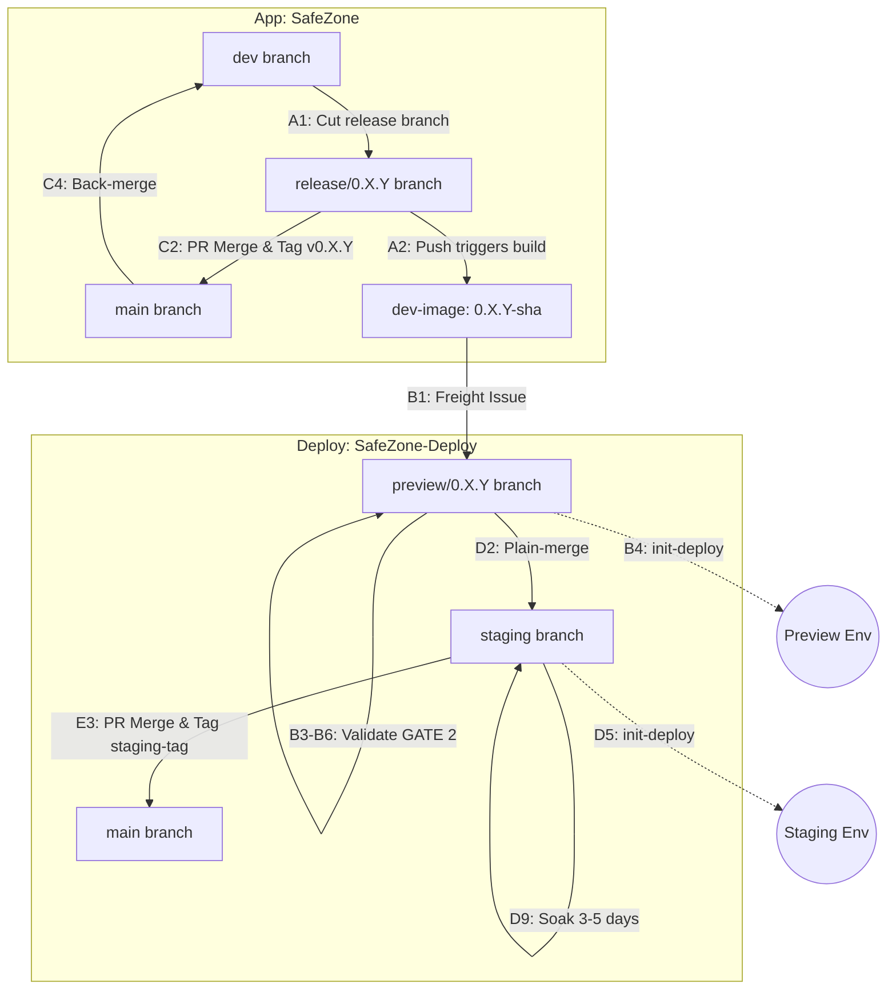

# SafeChord 統一交付工作流程 (App + Deploy)

> **狀態**：正式版本 (canonical)。已對齊至 `Docs/` 作為單一事實來源 (SSOT)。
> **範圍**：涵蓋 `SafeZone` (App) 與 `SafeZone-Deploy` (Deploy) 的端到端交付。
> **運行測試**：`v0.3.6` 已出貨並提升至 staging (自 2026-06-15 起 soaking)，採用先前的 **4 階段原地** 模型。
> **決策負責人**：bradyhau (架構師) · **作者**：Claude Code (開拓者)。流程與回覆由 Gemini (維護者) 審查。

---

**第一部分 — 流程 (THE FLOW)**

## 1. Repos、branches、tags 與 IssueOps 接觸點

**App `SafeZone` — GitFlow**
| 分支 | 角色 / 動作 |
| :- | :- |
| `feature/*` | 功能開發（本機） |
| `dev` | 整合主幹 — 執行 CI 檢查 (GATE 1) |
| `release/*` | **Release 分支 — 一次性**（自 dev 切出以隔離發行版；不加入新功能。接收 hotfix PR ➡️ 執行 GATE 1。tag 之後即凍結退役，post-GA 缺陷不重開此分支） |
| `main` | 生產主幹 — 合併 `release/*` 並標記 `v*.*.*` |

**Deploy `SafeZone-Deploy` — GitOps 分支**
| 分支 | 環境 | ArgoCD 同步目標 |
| :- | :- | :- |
| `preview/<ver>` | Dev 與叢集內驗證（臨時性；自 staging 重新切出） | `targetRevision=preview/<ver>` |
| `staging` | Soak 與持續展示環境 | `targetRevision=staging` |
| `main` | 黃金設定歸檔（僅歷史紀錄，不進行同步） | — |

**Tags**: `0.X.Y-<sha>` (Preview 映像檔) · `0.X.Y` (正式 App 發行映像檔) · `v0.X.Y` (Git 發行標記) · `v0.X.Y-staging` (救援基準線)。

**IssueOps 接觸點** (Deploy 儲存庫):
| 工單類型 / 標籤 | 觸發者 | 系統動作 | 人員動作 (簽核) |
| :- | :- | :- | :- |
| **`freight: 0.X.Y-<sha>`** | 推送 `release/0.X.Y` | 開啟 preview 工單，張貼檢查清單 | 驗證 GATE 2 ➡️ 留言附上證據 ➡️ 蓋上 `validated` 標籤 |
| **`release: v0.X.Y`** | 在 App 標記 `v0.X.Y` | 開啟 staging 佇列工單 | 驗證 soak (N-cycles) ➡️ 合併 `staging` 至 `main` ➡️ 關閉工單 |

## 2. Pipeline — Phase A–E

### Phase A — App 整合 (`SafeZone`)
- **A1.** 確保 `main` 是 `dev` 的祖先（執行 `git merge-base --is-ancestor origin/main origin/dev`）以防在前一版本尚未 back-merge 回 dev 之前就開啟新版。自 `dev` 切出 release 分支：`git checkout -b release/0.X.Y`，直接在 release 分支上將 App 的 `VERSION` 檔案更新為目標版本，並提交變更（例如 `chore(release): open v0.X.Y`）。
- **A2.** 將 `release/0.X.Y` 推送至遠端。此推送觸發 `publish-candidate (GitHub Action)` 以建置並推送 OCI 映像檔（參見 [ADR-1](#adr-1) 取得二進位提升的決策原因），並自動開啟 `freight: 0.X.Y-<sha>` 工單。

### Phase B — Preview 驗證 (`SafeZone-Deploy`)
- **B1.** 承接 `freight: 0.X.Y-<sha>` 工單。
- **B2.** 於 preview 分支撰寫設定。同時更新 `preview` 與 `staging` chart 的目標映像檔標籤與環境變數（參見 [ADR-2](#adr-2) 取得原子推廣的決策原因）➡️ **推送分支**。
- **B3.** 啟動 preview 基礎設施。
- **B4.** 觸發 `init-deploy.yml` 動作（env=preview）。
- **B5.** 執行 preview 驗證探針。
- **B6.** 人員簽核確認（UI 回應與外部連通性）。
- **B7.** 在 freight 工單蓋上 `validated` 標籤。
- **B8.** 卸除 preview 環境（先 app 後 infra）。

### Phase C — 切發行版（`SafeZone`，僅在 `validated` 之後）
- **C1.** 確認 freight 工單帶有 `validated` 標籤。
- **C2.** 將 `release/0.X.Y` 合併至 `main`（僅限 merge commit，不使用 squash），並標記 `v0.X.Y` 標籤。
- **C3.** 標記標籤將觸發發行 pipeline (GitHub Action)，將驗證過的 preview OCI 映像檔（標籤為 `0.X.Y-<sha>`）`crane copy` 至生產版本標籤（標籤為 `0.X.Y`）（參見 [ADR-1](#adr-1)），並自動開啟生產環境的 `release: v0.X.Y` 工單。
- **C4.** 將 `main` 反向合併 (back-merge) 回 `dev`，以傳播發行階段 of bug 修復。發行 pipeline (`release.yml`) 會在標記 tag 後自動建立一個「back-merge v0.X.Y -> dev」的 PR 以確保合規。*不變量 (Invariant)*：在切出下一個 `release/*` 分支之前，`dev` 必須收齊所有現存的發行修復檔（不留孤兒變更）。任何在 tag 標記之後（特別是 soak 期間）才發現的 defect，一律走 post-GA patch 流程 (子路徑 A1-post) 並自帶 back-merge，絕對不得重新開啟或修改已凍結退役的 `release/*` 分支。

### Phase D — Staging 部署 + Soak (`SafeZone-Deploy`)
- **D1.** 卸除現有的 staging 環境（保留外部/平台服務）（參見 [ADR-3](#adr-3) 取得 teardown-and-rebuild 的決策原因）。
- **D2.** 直接將 `preview/0.X.Y` **普通合併 (plain-merge)** 至 `staging`（不開啟 PR，不建立 staging 提升分支）（參見 [ADR-4](#adr-4) 取得 plain-merge 的決策原因）。
- **D3.** 於 `staging` 分支調整 staging環境差異（環境變數差異）➡️ **推送分支**。
- **D4.** 啟動 staging 基礎設施。
- **D5.** 觸發 `init-deploy.yml` 動作（env=staging）。
- **D6.** 執行 `/validate-release (AI Skill)`。
- **D7.** 人員驗證（UI 與外部連通性）。
- **D8.** 驗證成功後 ➡️ 於 `release: v0.X.Y` 工單上確認檢查清單。
- **D9.** 開始 soak（3–5 天）。

### Phase E — 歸檔 (`SafeZone-Deploy`)
- **E1.** 執行 `/validate-soak (AI Skill)`。
- **E2.** 確認所有 `release: v0.X.Y` 檢查清單項目已完成。
- **E3.** 於 `staging` 標記 `v0.X.Y-staging` 並將 `staging` PR 至 `main`（歸檔）。
- **E4.** 關閉 `release: v0.X.Y` 工單。

## 3. 例外情況與反覆迭代 (偏離快樂路徑)

- **重大故障與邊界變更（路徑 A — 必須返回 Preview 驗證）**：若在 preview 驗證、staging soak 或 showcase 期間發現問題，**嚴禁直接在 `staging` 分支上進行修補**。該變更必須經過 preview 驗證。若 staging soak 已經在運行中，則其 3–5 天的 soak 計時器**必須重設**：
  * **子路徑 A1-pre：Pre-GA 修補 (Pre-GA Patch，發行分支未標記/開啟中)**
    - *範圍*：在標記 tag 之前（發行分支 Y 仍在開發與驗證中，尚未正式出貨），修改 App 業務邏輯，或修改資料庫 Schema/DDL 腳本（因為腳本打包在 `safezone-ops-schema` 映像檔中），需要產生新的 OCI 映像檔。
    - *流程*：
      1. 於 App Repo (`SafeZone`) 自 `release/0.X.Y` 切出 `hotfix/*`，修正程式碼或資料庫腳本，並 PR 合併回 `release/0.X.Y`（執行 GATE 1 檢查）。
      2. 合併未標記 tag 的變更至 `release/0.X.Y` 會觸發 GitHub Action 建置新的 `0.X.Y-<sha>` 映像檔（版本前綴 `0.X.Y` 保持不變）。
      3. 於 Deploy Repo (`SafeZone-Deploy`) 的 `preview/0.X.Y` 分支更新 values 檔，將對應的映像檔標籤指向該新標籤並推送。
      4. 重新啟動 Preview 環境進行 GATE 2 驗證（執行 `init-deploy.yml (GitHub Action)` 並透過 `/validate-freight (AI Skill)` 驗證）。
      5. 驗證通過後，普通合併 `preview/0.X.Y` ➡️ `staging` 分支。
  * **子路徑 A1-post：Post-GA 修補 (Post-GA Patch，已標記 tag/已出貨)**
    - *範圍*：在官方標記 tag 且發行之後（於 soak 測試中或 showcase 期間），才發現需要修改 App 映像檔的缺陷。
    - *流程*：
      1. **嚴禁重新開啟**已退役的 `release/0.X.Y` 分支。相反地，直接從上一次官方發行的 release tag（例如 `v0.X.Y`）切出一個新的發行分支 `release/0.X.(Y+1)` —— 絕對不能直接從 `dev` 切出。
      2. 直接在新的 `release/0.X.(Y+1)` 分支上將 App 的 `VERSION` 檔案遞增為 `0.X.(Y+1)`，提交並推送。
      3. 透過 `hotfix/*` PR 將修補程式套用至 `release/0.X.(Y+1)`（執行 GATE 1）。合併將觸發建置新的 `0.X.(Y+1)-<sha>` 修補映像檔。
      4. 於 Deploy Repo 的 `preview/0.X.(Y+1)` 分支重跑 Preview 驗證 (GATE 2)。驗證成功後，普通合併至 `staging` 分支，並**啟動 Y+1 的全新 soak 計時器 (start the soak timer for Y+1)**。同時，將被取代之舊版本 Y 的 release 工單標記為 `superseded-by v0.X.(Y+1)` 並予以關閉，以避免多個 Staging 佇列重疊且舊版本無法順利跑完。
      5. 隨後走完標準的 Phase C 至 Phase E 流程（包括標記 `v0.X.(Y+1)` 並於 C4 執行反向合併至 `dev`）。
      *注意*：多個發行分支可能短暫並存（例如舊版本 Y 還在 soak 測試，新 patch Y+1 已經在切出驗證）。版本識別與 GHA pipeline 觸發必須支援 glob 匹配模式（例如 `release/0.X.*`）。
  * **子路徑 A2：不需建置映像檔的配置變更 (Config-only Border Changes)**
    - *範圍*：不需重新建置映像檔，但修改了 Ingress 路由、DNS、NetworkPolicy 或安全閘道等高風險部署配置。
    - *流程*：
      1. 於 Deploy Repo (`SafeZone-Deploy`) 的 `preview/0.X.Y` 分支上修正設定（例如調整 `values-preview.yaml` 與 `values-staging.yaml`）並推送。
      2. 重新啟動 Preview 環境進行 GATE 2 驗證，重點測試外部網路連通性與 Ingress 路由。
      3. 驗證通過後，普通合併 `preview/0.X.Y` ➡️ `staging` 分支。

- **低風險配置修補 (路徑 B — 直接於 Staging 修補)**：若修復僅涉及環境設定或值 (values) 調整（例如：非關鍵環境變數、資源限制或一般部署設定），且不觸及路徑 A1（映像檔變更）與路徑 A2（邊界配置變更）：
  1. **步驟**：直接在 `staging` 分支上進行修補（直接 commit）。ArgoCD 將原地調和變更。不需經過 Preview 驗證 (GATE 2)。
  2. **稽核工單**：
     - 若在 active soak 期間發現：直接追蹤於既有開啟的 `release: v0.X.Y` 工單上。
     - 若在 Showcase 期間發現：追蹤於新的自發性設定工單（例如 `Deploy #12`）。
  3. **限定範圍的重新 Soak (N-Cycles 規則)**：
     - 不重設 3–5 天的穩定性 soak 計時器。建立一個較短的觀察期，由元件的執行頻率客觀決定：
       - *排程任務*：涵蓋至少 2 個完整的執行週期 (N=2)，以驗證觸發正確性與冪等性（例如，對於每日排程器為 **48 小時 / 2 天**）。
       - *持續服務*：涵蓋 **6 到 12 小時**，以驗證穩定狀態的資源與記憶體輪廓。
     - 透過 `/validate-soak (AI Skill)` 驗證。若通過，在 `staging` 上標記 `v0.X.Y-staging`，並 PR `staging` 至 `main`（歸檔）。

- **Staging 救援**：若 Staging 環境發生故障，請參考 [7. 回滾與復原](#7-回滾與復原) 以執行暫時性固定與 forward-fix 流程。

---

**第二部分 — 原理 (THE RATIONALE)**

## 4. 部署模型 — 混合式 + 先決條件
*這**不是**純 GitOps。而是結合命令式分支提升流程（GitHub Actions + PRs/tags）與 GitOps 宣告式調和的混合模型。*

- **ArgoCD 擁有穩定狀態的調和。** 每個 `deploy/<env>/app/*.yaml` 都是一個自動同步的 `Application`（`targetRevision` = 環境分支；`path` = `helm-charts/safezone-<layer>` + `values-<env>.yaml`）。Helm 在 **ArgoCD 內部**渲染，而非作為 CI 的前置步驟。
- **按層排序** — ArgoCD 的健康驅動 sync-waves 無法跨越 Application，也無法可靠地門控 Job：
  - **Infra** → ArgoCD 原生 **sync-waves**（`ApplicationSet`：基礎 `-2` → 安全 `1` → 工作負載 `2` → 初始化 `3`）。
  - **App** → **`init-deploy.yml`** 按順序套用 Application CR，並在階段之間以 rollout/Job 健康狀態進行門控（基礎 → seed-schema → 核心 → smoke-test → seed-cases → ui → scheduler[staging]）。這是一個分階段的*引導程式 + 閘門*，而非一個命令式部署器 — 一旦 CR 存在，ArgoCD 就會調和它。（參見 [ADR-5](#adr-5) 取得混合部署的決策原因。）

## 5. IssueOps 主幹 — freight → release 生命週期
**目的：溯源，而非存取控制。** 這些 issue 使部署成為一個有證據、可追蹤的行為，並防止無根據的部署。它們**不是**防篡改的閘門（標籤可由人為修改；無職責分離）— 它們防止的是*疏漏*，而非蓄意繞過（單人、無攻擊者）。

- **`freight: 0.X.Y-<sha>`** (Preview 與驗證佇列)：
  - **用途**：做為 dev 映像檔在 preview 驗證 (GATE 2) 期間的**追蹤工單 (Tracking Ticket)** 與**驗證紀錄 (Verification Record)**。
  - **生命週期**：
    - *開啟*：當 `release/0.X.Y` 分支推送至遠端時，由 `publish-candidate (GitHub Action)` 管線自動建立。
    - *驗證*：由 `init-deploy.yml` 張貼自動化驗證檢查清單。運作人員手動執行並於留言貼上驗證證據後，由 `/validate-freight (AI Skill)` 蓋上 `validated` 標籤。
    - *關閉*：在發行 pipeline (`release.yml`) 完成提升並切出發行版後，由系統自動關閉。
  - **稽核規範**：運作人員所貼上的**證據留言 (evidence comment)** 是系統正式的認證紀錄，而 `validated` 標籤則是發行 pipeline 用以判定是否前進的機器唯讀索引。

- **`release: v0.X.Y`** (Staging 與歸檔工作佇列)：
  - **用途**：做為 Staging 部署、穩定性 soak 測試以及最終生產環境歸檔的**追蹤工單 (Tracking Ticket)** 與**稽核軌跡 (Audit Trail)**。
  - **生命週期**：
    - *開啟*：當 App 儲存庫標記官方 `v0.X.Y` 標籤時，由發行 pipeline 自動建立。
    - *驗證*：用以追蹤部署後驗證，透過 `/validate-release (AI Skill)` 與 3–5 天 soak 測試的自動化/人工檢查清單。
    - *關閉*：在 `staging` 分支標記為 `v0.X.Y-staging` 且普通合併至 `main` (歸檔) 後，由運作人員手動關閉。
  - **稽核規範**：由於 Staging 提升省略了合併前的 PR 審查（參見 [ADR-4](#adr-4)），此工單與其對應的 git merge commit 是系統唯一的發行稽核紀錄。若在 soak 期間進行了僅限 Deploy 的設定修補，應直接留言記錄在此開放的 release 工單中（若在 Showcase 期間則記錄在自發性設定工單如 `Deploy #12`），以避免工單膨脹。

## 6. 版本管理 — 解耦演進策略
App 與 Deploy 版本號獨立漂移，以分別反映各自 the 發行單位：
*   **App Repo（`SafeZone`）**：VERSION 定義在 `/SafeZone/VERSION`（由對應的 GitHub Milestone 治理，用以聚合目標週期的 issue）。在程式碼變更時更新。映像檔使用 `appVersion` 標記（例如 `0.3.6`）。
*   **Deploy Repo（`SafeZone-Deploy`）**：設定版本定義在所有子 chart 的 `Chart.yaml` `version` 欄位中。在任何設定/chart 變更時全域更新所有 chart。`Chart.yaml` 中的 `appVersion` 作為指向目標 App 映像檔標籤的指標。（註：二方庫 chart `safezone-common` 的 `appVersion` 固定為 `"1.0.0"`，不參與此標籤漂移。）
*   **更新矩陣**（假設初始基準線為 App `0.3.6` / Deploy `0.3.6`）：
    1.  **共同變更（情境 A）**：App 程式碼變更並發行新版 `0.3.7`；Deploy 設定也同步調整以支援新功能。Deploy 的 Chart `version` 遞增至 `0.3.7`，且 `appVersion` 更新為 `"0.3.7"`。
    2.  **僅 Deploy 修正（情境 B）**：App 保持在 `0.3.7` 不變。Deploy 進行設定修補。Deploy 的 Chart `version` 遞增至 `0.3.8`，而 `appVersion` 則維持在 `"0.3.7"`。
    3.  **僅 App 修正（情境 C）**：App 程式碼變更並發行新版 `0.3.8`；Deploy 設定無結構性變更。為了指向新映像檔，Deploy 的 Chart `version` 遞增至 `0.3.9`，而 `appVersion` 則更新為 `"0.3.8"`。
*   **`VERSION` 更新紀律**：
    - 在發行週期開始時（步驟 A1），App 的 `VERSION` 檔案會直接在 `release/*` 分支上更新以設定目標版本（例如 0.3.7），以確保發行代碼庫的 frozen-pin 語意。在此週期產生的所有 dev 映像檔都將使用此版本作為前綴（`0.3.7-<sha>`）。
    - **保護措施**：為防止人為錯誤，發行 pipeline (`release.yml`) 在最終 Git 標籤 (例如 `v0.3.7`) 與 App `VERSION` 檔案內容不一致時會自動失效。此外，發行版一律自專用的 `release/*` 分支切出（作為該版本程式碼的**凍結鎖定**），保證未經驗證的變更無法繞過發行閘門。

## 7. 回滾與復原
*   **僅前向修復 (Forward-fix)**：專案不支援自動回滾；所有問題皆透過推送 forward-fix 解決。
*   **Staging 救援**：若 staging環境故障，ArgoCD `targetRevision` 可暫時固定至已知正常的發行標籤（`v0.X.Y-staging`）以恢復展示功能，同時準備 forward-fix。

---

**附錄**

## A. 架構決策記錄 (關鍵決策原理)

### ADR-1
**透過 Crane Copy 進行二進位提升**
* **決策**：發行工件直接使用 `crane copy` 進行提升（保留完全相同的 digest 哈希值），而非在發行階段從原始碼重新建置。
* **原因**：在發行階段從原始碼重新建置可能會引入細微的環境或依賴漂移（例如浮動的基礎標籤、更新的 upstream 套件），導致產生的二進位檔案與在 Preview 驗證過的不一致。透過 `crane copy` 複製完全相同的已驗證容器映像檔 digest（直接將 preview 階段的 `0.X.Y-<sha>` 標籤複製並重新標記為官方正式的 `0.X.Y` 發行標籤），能保證「出貨的內容與測試過的內容完全一致」。

### ADR-2
**原子設定推廣**
* **決策**：所有環境（包括 `preview` 與 `staging` 值）的特異性設定皆於 `preview/0.X.Y` 分支上共同宣告與修改，並作為原子提交區塊一同推廣。
* **原因**：在多分支的 GitOps 工作流程中，若僅在切換到該環境分支時才更新環境特異性值（例如 `values-staging.yaml`），會增加人為錯誤的機率（例如忘記加入新發行版所需的環境變數）。在發行前分支（preview）上預先定義所有設定，能確保設定依賴是原子性的、一同經過測試，且在合併時自動推廣，進而顯著減少合併後的漂移與部署失敗。

### ADR-3
**Staging 環境的 Teardown-and-Rebuild 推廣**
* **決策**：Staging 部署在重建前會執行完整的基礎設施卸除 (teardown)，而非原地進行滾動更新。
* **原因**：在 `v0.x` 階段，資料庫 Schema 與平台網路的破壞性變更非常頻繁。為每個發行版撰寫向後相容的資料庫遷移與滾動部署腳本會帶來極高的維護成本。確定性的 teardown-and-rebuild 提供了一個乾淨的起點，消除了設定漂移，能在 10 分鐘內恢復，並為展示環境的穩定性提供最高的可靠度。

### ADR-4
**普通合併 (Plain-Merge) 推廣至 Staging**
* **決策**：將 `preview/0.X.Y` 設定合併至 `staging` 分支時，直接採用 plain-merge，不開啟 PR 進行代碼審查。
* **原因**：Preview 設定已在 GATE 2 期間於叢集內經過徹底驗證（包括人員連通性與自動化檢查清單）。在目前的單人開發規模下，若每次環境推廣都要求正式的 GitHub PR 會產生不必要的流程摩擦。審查軌跡已透過合併提交歷史與 IssueOps 發行工單完整保留。

### ADR-5
**混合部署（透過 init-deploy 進行分階段引導）**
* **決策**：我們採用混合部署 model：針對靜態基礎設施與應用部署，使用 ArgoCD 的宣告式調和收斂；結合命令式工作流程執行器 (`init-deploy.yml`)，根據 Job 健康狀態編排分階段部署與門控發行階段。
* **原因**：先前嘗試過使用 sync-waves 與 Job hooks 的純 ArgoCD 路徑但宣告失敗。ArgoCD 的 wave 進展與 hook 完成依賴於其內部的 Job health 評估，該評估往往在 Job 實際完成執行前就判定成功並繼續推進。混合執行器將宣告式狀態收斂與命令式 execution 門控解耦，為資料庫 Schema 植入 (seeding) 與 smoke test 提供了可靠的編排閘門。
