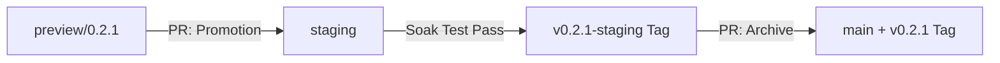

# SafeZone 部署與 GitOps 流程 (v2)

本文件規範了 `SafeZone-Deploy` (Config Repository) 的運作邏輯。我們採用 **GitOps** 模式，以 Git 倉庫的狀態作為叢集的期望狀態。

## 1. 核心設計哲學

為了在 MVA (Minimum Viable Architecture) 環境下達成「生產等級」的交付穩定性，我們結合了兩種模式：

*   **聲明式穩態 (ArgoCD)**: 負責將 Git 中的 YAML 持續同步到叢集，並監控資源漂移。
*   **Phase 化指令式編排 (GitHub Actions)**: 負責執行有狀態的任務（如資料灌入、健康探測、環境生命週期管理）。
*   **務實的回溯 (Pragmatic Rollback)**: 在 0.x 快速迭代期，不開發過度工程的自動回退腳本，而是透過 **Git Tagging** 建立環境的「救命繩 (Rollback Baseline)」。

---

## 2. 分支模型 (Branch Promotion Model)

我們移除冗餘的 `dev` 分支，每個分支對應一個**生命週期階段**：

| 分支名稱 | 生命週期階段 | 標籤策略 (Tagging) | ArgoCD Sync |
| :--- | :--- | :--- | :--- |
| **`preview/<version>`** | **開發驗證** | **無標籤** (隨 PR 銷毀) | 自動更新 `safezone-preview` |
| **`staging`** | **浸潤測試 / 展示** | **`v0.x.y-staging`** (回溯點) | 自動同步 `safezone` |
| **`main`** | **版本歸檔 (Golden)** | **`v0.x.y`** (正式版) | 手動歸檔 (不綁定環境) |

### 為什麼 Preview 分支不打 Tag？
`preview/` 分支是**瞬態 (Transient)** 的「提案」。其生命週期與 PR 綁定，任務是驗證草稿。打標籤會導致 Git 歷史充滿無意義的垃圾，因此 Preview 環境隨分支合併/關閉即刻銷毀。

---

## 3. 標準作業流程 (SOP)

### 場景 A: 版本開發與 Preview 驗證
1.  **建立分支**：從 `staging` 切出 `preview/<version>`（如 `preview/0.3.0`）。
2.  **配置變更**：修改 Helm Chart、更新映像檔 Tag。
3.  **驗證**：GitHub Actions 自動更新 `safezone-preview` 環境。

### 場景 B: 晉升至 Staging (Promotion)
1.  **發起 Promotion PR**：`preview/<version>` → `staging`。
2.  **環境適配 (Environment Adaptation)**：在 PR 中將配置調整為 Staging 專用的設定（例如將 `db-replica-ro` 改為 `db-replica-rw` 以適配目前的資料庫架構）。
3.  **晉升決策**：PR 合併即代表決策紀錄，合併後觸發 Staging 編排流水線。

### 場景 C: 建立回溯點與歸檔 (Rollback Baseline & Archive)
1.  **浸潤測試 (Soak Test)**：在 Staging 運行 3-5 天。
2.  **下標籤 (Checkpoint)**：測試通過後，手動在 `staging` 下標籤 `v0.x.y-staging`。
    *   *價值*：若下一個版本搞爛了 Staging，ArgoCD 可直接將 `targetRevision` 切回此標籤進行回溯。
3.  **正式歸檔**：將 `staging` 合併至 `main` 並打上正式版本標籤 `v0.x.y`。

---

## 4. GitHub Actions 編排器 (Phase 化部署)

我們將 `init-deploy.yml` 劃分為多個 Phase，確保部署的順序性。

### Phase 0: 預驗證 (Pre-validation)
*   執行 `helm template` 渲染。防止損壞的 YAML 推送到叢集，讓 CI 提早報錯。

### Phase 1-5: 指令式編排
1.  **Infra Readiness**：主動探測 DB、Kafka 是否可連線（`kubectl exec ... ping`）。
2.  **Seeding**：觸發 `safezone-seed` Job 並等待完成。
3.  **App Sync**：確認 API 健康檢查回應正常。

### Phase 6: 環境維護 (Staging Only)
*   **Scheduler 整合**：啟用 `safezone-scheduler` (CronJob)，每日自動模擬生成數據，維持環境真實感。

---

## 5. ADR: 從 v1 到 v2 的演化決策

### 為什麼砍掉 `dev` 分支？
在單人 MVA 專案中，`dev` 增加了合併成本卻無整合價值。v2 將焦點轉向 **"Promotion = PR"**，讓每次晉升都有明確的變更紀錄。

### 為什麼 Staging 開放 Feature 分支？
Staging 是一個**活躍的整合環境**。對於 infra 層級（如 NetworkPolicy）的調整，應允許直接在 Staging 操作，而不是強迫走 Preview 繞路。

### 為什麼選擇手動 Tag Rollback？
在 0.x 快速迭代期，自動化 Rollback 腳本容易因 Schema 頻繁變動而壞掉。使用 **Staging Tag** 作為回溯點，是成本最低且說服力最強的權宜之計——它承認風險，並用 GitOps 的本質（Git Ref 切換）來解決問題。
