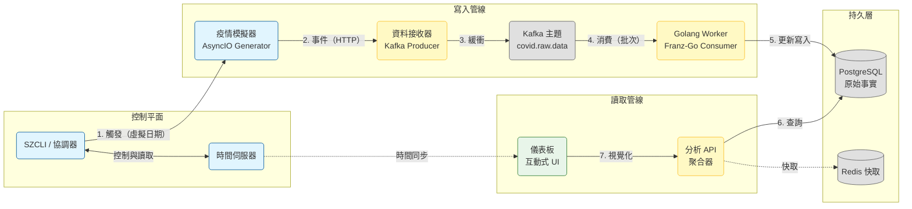

# 🗺️ SafeZone 應用程式地圖

> **類型**：地圖（架構總覽）
> **上下文**：事件驅動的分散式疫情模擬與分析引擎。

---

## 1. 系統上下文與資料流

SafeZone 設計為單向資料處理管線。資料由模擬器產生，經緩衝區處理以提升彈性，再持續寫入結構化視圖，以支援高效能查詢。

---

## 2. 微服務索引

SafeZone 遵循**關注點分離**原則，將邏輯解耦至各專業微服務。

### 2.1 寫入管線
負責高併發資料接收與持久儲存。

| 服務 | 角色 | 關鍵技術 | 文件 |
| :--- | :--- | :--- | :--- |
| **疫情模擬器** | **資料來源** | AsyncIO, httpx, Pandas | [藍圖](safechord.safezone.service.pandemicsimulator.md) |
| **資料接收器** | **閘道** | FastAPI, aiokafka | [藍圖](safechord.safezone.service.dataingestor.md) |
| **Worker (Golang)** | **消費者** | Golang, Franz-Go | [藍圖](safechord.safezone.service.worker.md) |

### 2.2 讀取管線
負責資料聚合與使用者呈現。

| 服務 | 角色 | 關鍵技術 | 文件 |
| :--- | :--- | :--- | :--- |
| **分析 API** | **聚合器** | FastAPI, Redis, SQLAlchemy | [藍圖](safechord.safezone.service.analyticsapi.md) |
| **儀表板** | **視覺化工具** | Plotly Dash, httpx | [藍圖](safechord.safezone.service.dashboard.md) |

### 2.3 工具組與協調
支援性元件，負責維護模擬的狀態與運作。

| 元件 | 角色 | 關鍵技術 | 文件 |
| :--- | :--- | :--- | :--- |
| **SZCLI** | **控制器** | Python Typer | [參考](safechord.safezone.toolkit.cli.md) |
| **時間伺服器** | **全域時鐘** | FastAPI | [藍圖](safechord.safezone.toolkit.timeserver.md) |

---

## 3. 關鍵架構特性

1.  **事件驅動解耦**：
    *   寫入路徑透過 **Kafka** 完全解耦。接收器（閘道）與 Worker（處理器）可獨立擴展。
    *   **價值**：流量高峰時，接收器僅負責快速接收資料；Worker 則根據處理能力平穩地寫入資料庫（負載均攤）。

2.  **多語言實作**：
    *   **Python**：用於複雜領域邏輯（模擬器、API）以及快速迭代 UI（儀表板）。
    *   **Golang**：用於運算密集型、高吞吐量的任務（Worker），以最大化資源使用效率。

3.  **時間感知**：
    *   SafeZone 支援「虛擬時間線」。所有與時間相關的元件（模擬器、儀表板）皆參照**時間伺服器**，而非系統時鐘。
    *   **價值**：支援「時光旅行」模擬（快進或暫停疫情進程），以利除錯與預測。

---

## 4. 運維連結

*   **部署架構**：[部署與運維](safechord.safezone.deployment.md)
*   **CI/CD 管線**：[CI/CD 工作流程](safechord.safezone.workflow.md)
*   **API 規格**：請參閱各服務藍圖中的**介面**章節。